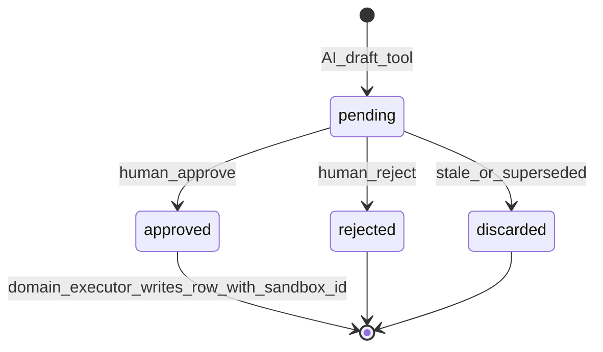
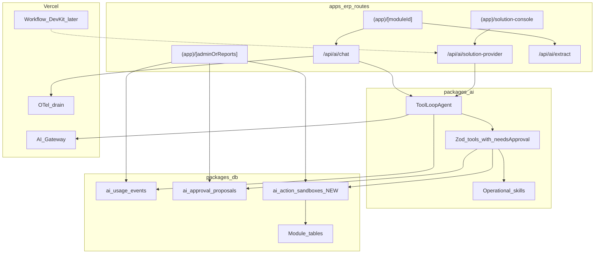

# Afenda AI — Vercel evolution, corrected and stabilized

Goal: maximum ERP value per change, with one consistent execution layer. Respects DRY (one source of truth per concept), KISS (one state machine, generic table), YAGNI (no LMS-only plumbing before a single sandbox executes).

---

## Errors and drift found (the "wrong session" parts)

These are concrete inconsistencies between docs, code, and Vercel guidance. They must be resolved **before** any new phase.

| #   | Issue                                                                                                                                                                                                                         | Where                                                                                                                                                                                             | Correction                                                                                                                                  |
| --- | ----------------------------------------------------------------------------------------------------------------------------------------------------------------------------------------------------------------------------- | ------------------------------------------------------------------------------------------------------------------------------------------------------------------------------------------------- | ------------------------------------------------------------------------------------------------------------------------------------------- |
| 1   | **Sandbox state machine mismatch.** TRACK-001 says `pending \| approved \| rejected \| executed \| rolled_back`. Code says `pending \| approved \| rejected \| discarded` and only implements `pending → approved\|rejected`. | [`schemas/operations.ts`](packages/ai/src/schemas/operations.ts) `sandboxStatusSchema`, [`sandbox.ts`](packages/ai/src/sandbox.ts), [TRACK-001](docs/roadmap/001-ai-operation-execution-layer.md) | DRY/KISS: align doc to code now. Add `executed` only when a domain executor exists; `rolled_back` only when a real undo path exists.        |
| 2   | **Sandbox object is built then discarded.** `proposeHumanApprovedAction` calls `createActionSandbox(...)` and never returns or persists it.                                                                                   | [`solution-provider-tools.ts`](packages/ai/src/tools/solution-provider-tools.ts) (line ~592)                                                                                                      | Persist via a new `ai_action_sandboxes` table; return the sandbox id in tool output for the UI to reference.                                |
| 3   | **Two roadmap docs describe sandboxes** with different shapes.                                                                                                                                                                | This plan + TRACK-001                                                                                                                                                                             | DRY: TRACK-001 owns the **execution layer**; this plan references it and owns **surfaces / Vercel adoption**.                               |
| 4   | **TRACK-001 conflates infrastructure (sandboxes) with a new domain (LMS).** Five new LMS tables before any sandbox executes.                                                                                                  | TRACK-001 “Data and Permissions”                                                                                                                                                                  | YAGNI: split into two tracks. Sandboxes generic, LMS later, and only `lms_courses` + `lms_enrollments` for first cut.                       |
| 5   | **Default AI model `openai/gpt-5.4` is likely stale.** Vercel docs show `openai/gpt-5.5` and `anthropic/claude-opus-4.7` as current; `5.4` doesn’t appear in `/v1/models` examples.                                           | [`packages/ai/src/gateway.ts`](packages/ai/src/gateway.ts) constants                                                                                                                              | Query `gateway.getAvailableModels()` once, update three constants. Keep override env vars.                                                  |
| 6   | **Redundant Gateway tag `app:afenda-erp`.** Only one app exists.                                                                                                                                                              | [`createGatewayOptions`](packages/ai/src/gateway.ts)                                                                                                                                              | YAGNI: drop the constant tag; keep variable tags (`feature`, `organization`, `module`, `risk`, `env`).                                      |
| 7   | **Operational skill metadata references schemas by string name** (`inputSchemaName: "BusinessProblemInput"`) but nothing resolves these.                                                                                      | [`operational-skills.ts`](packages/ai/src/operational-skills.ts)                                                                                                                                  | YAGNI: either remove the fields or wire to a schema registry. Recommendation: keep fields (cheap), document as "for catalog UI only".       |
| 8   | **`@afenda/workflows` ≠ Vercel Workflow DevKit.** Same word, different runtime. Confuses doctrine.                                                                                                                            | [`packages/workflows`](packages/workflows/src/index.ts), TRACK-001 “Durable workflows” line                                                                                                       | Rename references: "ERP cron sweeps" vs "Vercel WDK".                                                                                       |
| 9   | **TRACK-001 scope drift.** Title says LMS; goal in summary mixes LMS + sandbox infra.                                                                                                                                         | TRACK-001 file                                                                                                                                                                                    | Rename to `001-ai-operation-execution-layer` (file name already correct); make sandboxes the deliverable; LMS becomes an appendix consumer. |
| 10  | **Plan dependency on Vercel link was overstated** in the earlier version. Local Gateway key is sufficient for ERP feature work.                                                                                               | Previous plan                                                                                                                                                                                     | Move link to a parallel enabler track.                                                                                                      |

---

## Maturity (corrected, 1–5)

| Dimension                           | Score | Note                                                     |
| ----------------------------------- | ----- | -------------------------------------------------------- |
| AI SDK / Gateway alignment          | 4.5   | SDK v6, ToolLoopAgent, tagged Gateway, AI Elements UI    |
| Tenant safety (capability + Zod)    | 4.5   | Server session is single source of org id                |
| Operational skills catalog          | 4     | Seven recovery skills already shipped                    |
| **Sandbox persistence + execution** | **2** | In-memory only; no DB row                                |
| Admin AI observability surface      | 2.5   | DB rows exist (`ai_usage_events`, approvals); UI is thin |
| Vercel platform usage               | 2     | Local Gateway key only; link deferred                    |

Bottleneck: row 4. Everything else is a phase-2 polish.

---

## Single source of truth split (DRY)

| Concept                                           | Owner doc                                                     | Why                                |
| ------------------------------------------------- | ------------------------------------------------------------- | ---------------------------------- |
| Sandbox schema, state machine, executor contract  | [TRACK-001](docs/roadmap/001-ai-operation-execution-layer.md) | One canonical execution layer      |
| Where AI shows up in the ERP (operators + admins) | this plan                                                     | UI placement is product, not infra |
| Vercel platform adoption order                    | this plan                                                     | Cross-cutting; not specific to LMS |
| Module domain tables (incl. LMS)                  | per-feature roadmap entries when needed                       | YAGNI until execution proves       |

After this update, TRACK-001 will be **module-agnostic**: a generic operation execution layer (sandboxes, evidence, approvals). LMS becomes an *appendix consumer* once the layer works.

---

## Corrected roadmap — Now / Next / Later

KISS: three buckets, not five phases. Each item is independently shippable.

### Now (no platform work needed — local Gateway key is enough)

1. **Reconcile sandbox state machine** — edit TRACK-001 only; no code change yet. Align to existing `pending | approved | rejected | discarded`. Decide separately whether `executed` deserves a status or lives as a foreign key from the **target domain row → sandbox id**.
2. **Persist sandboxes** in a single generic table:
   - `ai_action_sandboxes` in `@afenda/db` (org-scoped, indexed by org + status).
   - Repo helpers in `@afenda/db`: `createAiActionSandbox`, `listAiActionSandboxes`, `transitionAiActionSandbox`.
   - Wire `proposeHumanApprovedAction` ([`solution-provider-tools.ts`](packages/ai/src/tools/solution-provider-tools.ts)) and `proposeApprovalDecision` ([`erp-tools.ts`](packages/ai/src/tools/erp-tools.ts)) to persist + return id.
3. **ERP surfacing** — put the existing assistant on `[moduleId]` workspaces (today only dashboard); link Solution Console skill cards to module records/work items.
4. **Admin AI ledger** — use existing `listAiUsageEvents`/`AiUsageSummary` in [`packages/domain/src/index.ts`](packages/domain/src/index.ts) to render a governed list under reports/admin. No new tables.
5. **Model id audit** — replace `openai/gpt-5.4` defaults with current `gateway.getAvailableModels()` ground truth in [`gateway.ts`](packages/ai/src/gateway.ts).
6. **Tag cleanup** — remove `app:afenda-erp`; keep `feature/organization/module/risk/env`.

### Next (parallel: Vercel link + Gateway ops)

These do **not** block Now; do them when stabilization gate passes per [`vercel-link.md`](docs/development/vercel-link.md).

1. `vercel link` → `afenda-erp`; `vercel env pull`; preview deploy; smoke `/api/ai/*` on OIDC.
2. **Provider failover** for high-risk features (`solution-provider`, `approval-tools`) via `providerOptions.gateway.order`.
3. **Admin spend view** using `gateway.getSpendReport({ groupBy: 'tag', tags: [...] })` over existing `feature:` and `organization:` tags.
4. **`zeroDataRetention: true`** on `/api/ai/extract` (HR/finance documents).
5. **OpenTelemetry traces** via existing `@vercel/otel` dep — attach spans to AI route handlers.

### Later (only after Now executes end-to-end)

1. **Domain executor** for an approved sandbox — single proof skill first (recommend: `revenue-leakage-recovery` against existing sales workspace).
2. **Vercel Workflow DevKit** for multi-day approval reminders and "re-run recovery in 7 days" via `defineHook` + `sleep`.
3. **LMS proof module** — only when sandbox execute path is boring. Initial cut = `lms_courses` + `lms_enrollments`. Drop `lms_assessments` and `lms_certifications` from TRACK-001 first scope (YAGNI).
4. **Module tools migration** to `@afenda/feature-*` packages ([ARCH-002](docs/architecture/002-erp-domain-package-architecture.md)).
5. **Embeddings / semantic search** — direct provider, not Gateway, per ARCH-001. Only with a concrete operator query that requires it.

---

## Sandbox state machine — corrected (KISS)

Aligns code, doc, and operator mental model.

- `executed` is **not** a sandbox status. It is a foreign key from the **created domain row** (e.g., a new `lms_course`) back to the sandbox id. Reason: keeps the sandbox table generic and avoids dual-write inconsistencies.
- "Rollback" = a new sandbox of `actionType: "rollback-<original-action-type>"` referencing the original. No special status.

This matches the existing Zod schema and code; only TRACK-001 needs to change.

---

## DRY / KISS / YAGNI checklist (applied to the prior plan)

| Principle   | What we removed / changed                                                            | Why                                             |
| ----------- | ------------------------------------------------------------------------------------ | ----------------------------------------------- |
| DRY         | One execution layer doc (TRACK-001); plan stops describing sandbox internals         | Two sources of truth caused state-machine drift |
| DRY         | Reuse `listAiUsageEvents` and `ai_approval_proposals` — no parallel "admin AI table" | Already in `@afenda/db`                         |
| KISS        | 3 buckets (Now / Next / Later), not 5 phases                                         | Phases implied dependencies that don't exist    |
| KISS        | Single generic `ai_action_sandboxes` table                                           | One state machine, all modules                  |
| YAGNI       | LMS tables `lms_assessments`, `lms_certifications` dropped from first cut            | No operator pulled for them yet                 |
| YAGNI       | No new module (`lms`) until sandbox executor proven                                  | Avoid double-risk launch                        |
| YAGNI       | Defer Workflow DevKit, embeddings, ERP MCP, Vercel Agent                             | None of these change current operator outcomes  |
| YAGNI       | Drop redundant Gateway tag `app:afenda-erp`                                          | Single-app constant                             |
| Correctness | Audit model ids via `getAvailableModels()`                                           | Prevents 404s in prod                           |

---

## Mermaid — corrected end state

---

## Verification (per change, KISS)

| Touch                                 | Gate                                                                          |
| ------------------------------------- | ----------------------------------------------------------------------------- |
| Markdown only (TRACK-001 + this plan) | Visual review                                                                 |
| Sandbox table + repo helpers          | `pnpm db:generate`, `pnpm typecheck`, `pnpm test`, `pnpm architecture:check`  |
| Tool wiring                           | `pnpm --filter @afenda/ai test` (eval script) + new unit test for persistence |
| Governed admin view                   | `pnpm lint:governed-renderers` + `pnpm test`                                  |
| Model id update                       | `pnpm typecheck`; runtime smoke against Gateway                               |
| Vercel link                           | Per [`vercel-link.md`](docs/development/vercel-link.md) gate                  |

---

## Companion edits queued for execution

When you say *execute*, the changes are:

1. Rewrite [`docs/roadmap/001-ai-operation-execution-layer.md`](docs/roadmap/001-ai-operation-execution-layer.md) — execution layer is module-agnostic; LMS becomes an appendix; state machine matches code.
2. (Code, agent mode) Add `ai_action_sandboxes` table + repo helpers; persist in two tool call sites listed above.
3. (Code, agent mode) Move `[moduleId]` assistant entry; admin AI ledger view.
4. (Code, agent mode) Model id audit + Gateway tag cleanup.

Item 1 is **markdown-only** and can happen in plan mode; items 2–4 require `SwitchMode` to agent.

---

## Key references

- Execution layer doc (owns sandbox details): [TRACK-001](docs/roadmap/001-ai-operation-execution-layer.md)
- Doctrine: [ARCH-001 § AI Architecture](docs/architecture/001-system-architecture.md)
- Vercel link procedure: [vercel-link.md](docs/development/vercel-link.md)
- AI package: [`packages/ai`](packages/ai)
- DB schema (AI): [`packages/db/src/schema/ai.ts`](packages/db/src/schema/ai.ts)
