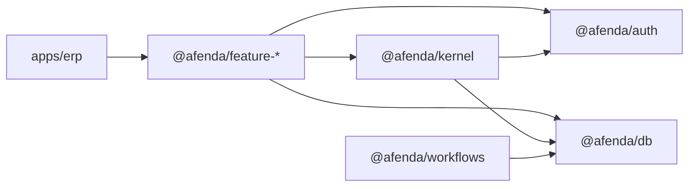

# ARCH-002 · ERP Platform & Kernel Architecture

**Doc ID:** `ARCH-002` · **File:** `002-erp-kernel-package-architecture.md`

| Field      | Value                                                                                                                                 |
| ---------- | ------------------------------------------------------------------------------------------------------------------------------------- |
| Status     | Active — platform map, package boundaries, and execution-kernel doctrine (May 2026)                                                   |
| Authority  | Feature-package extraction, `@afenda/kernel` scope, import rules, execution enforcement, Vercel single-app build model                |
| Supersedes | Per-module route folders, microfrontend deployment assumptions, and split “kernel map” vs “execution kernel” reading paths            |
| Related    | **ARCH-001** (runtime/deploy) · **ARCH-003** (package categories) · **ARCH-005** (schema) · **ARCH-006**/**ARCH-007** (governed UI) · **ARCH-008** (workspace discipline) · **ARCH-011** (System Admin control plane) |

Afenda ERP is **features-first**: finance stays in `@afenda/feature-finance`, and so on. The deployable app composes routes; platform packages (`auth`, `db`, `workflows`, …) provide pipes. HR product code is not in-repo until TRACK-004 rescaffolds `@afenda/feature-hr` (see **ARCH-010**).

`@afenda/kernel` is **only** the shared **execution-law** slice inside that picture (plus **frozen** legacy compat code — see §3). It is not a dumping ground for shared utilities, not the product “dual kernel” (white-collar / blue-collar — **ARCH-012** reserved), and not module business logic.

---

## 1. Platform mental model

Use this table before placing code. “Kernel” answers **may this actor run this protected action in this org?** — not every shared utility.

| Package | Role | Typical examples |
| ------- | ---- | ---------------- |
| `apps/erp` | Deployable Next.js app — routes, layouts, thin adapters | `page.tsx`, `workspace-routes/`, API route handlers |
| `@afenda/feature-*` | Module business behavior | HR employee commands, finance posting rules |
| `@afenda/db` | Physical schema, migrations, tenancy helpers, command primitives | `schema/hr.ts`, RLS, `getDb()` |
| `@afenda/auth` | Session, organization resolution, capability **source** | Neon Auth, `requireCapability` inputs |
| `@afenda/kernel` | Module registry, shared contracts, **execution authority**, formatting helpers, temporary list compat | `execution-kernel/`, `erp-formatting.ts` |
| `@afenda/workflows` | Durable cross-module jobs and housekeeping | Cron handlers, approval orchestration |
| `@afenda/governed-surface` | Metadata schemas and governed renderers | Pattern A/B/C list windows |
| `@afenda/ui` | Presentation primitives only | shadcn-based components |
| `@afenda/ai` / Lynx (`ARCH-009`) | Machine layer — substrate-blind tools, operator surfaces | Not imported by kernel for enforcement |

**Runtime “CPU”** (Node, Next.js, Vercel, caching) is **ARCH-001**, not `@afenda/kernel`.



---

## 2. What `@afenda/kernel` means

The name `kernel` is intentional and **narrow**:

| Kernel **is** | Kernel **is not** |
| ------------- | ----------------- |
| Shared ERP contracts and module registry | Finance / HR / inventory business rules |
| Execution context, access verdicts, policy envelope, audit contract | System Admin screens or configuration UI |
| Guarded execution wrapper for protected mutations | App runtime, deploy model, or Lynx brand layer |
| Cross-module formatting and serialization helpers | Generic event bus for all domain events |
| **Temporary** list-surface builders until feature extraction | Drizzle schema or migrations |

`domain` still describes business areas (finance, HR, inventory); those implementations belong in `@afenda/feature-*`.

---

## 3. Maintenance policy (default — no big-bang refactors)

**Leave the package in place; do not delete it.** Consumers span the app, workflows, and feature packages. Day-to-day work should **not** require editing most of `packages/kernel/src/`.

| Zone | Path (under `packages/kernel/src/`) | Policy |
| ---- | ----------------------------------- | ------ |
| **Active** | `execution-kernel/` | Extend when a feature needs org context, permission verdicts, policy registration, or audit writes. Update **§5** and `execution-kernel` tests in the same change. |
| **Frozen** | `index.ts`, `modules/*-surfaces.ts`, `shell/*`, `shared/workspace-*`, `getModuleWorkspace*` | **No new features.** Bugfix-only if generic routes break. New modules use `@afenda/feature-*` surfaces and DB commands — not kernel list builders. |
| **Incidental** | `shared/erp-formatting.ts` | Use from features until a dedicated `@afenda/lib` exists; do not grow kernel for formatting-only needs. |

**Feature development (normal path):**

1. Business logic → `@afenda/feature-<moduleId>`.
2. Schema / commands → `@afenda/db`.
3. Protected server actions → `requireExecutionContext` / `requireExecutionPermission` / `writeExecutionAuditEvent` from `@afenda/kernel/execution` (or `@afenda/kernel/server`).
4. Do **not** add module rules, HITL flows, or UI to the kernel package.

**Architecture doc upkeep:** When `execution-kernel/` contracts change, update **§5** here in the same PR. Do not duplicate long doctrine in `packages/kernel/kernel-architecture.md` (supplement only).

**Automated enforcement (no human gate):**

| Layer | What runs |
| ----- | --------- |
| **Cursor `preToolUse`** | `guard-kernel-boundary-imports.mjs` — **denies** edits that import `@afenda/feature-*` into `packages/kernel/` |
| **Cursor `postToolUse`** | `enforce-architecture-drift.mjs` — runs `scripts/enforce-architecture-drift.mts` for the edited path; agent must fix failures (do not ask the user to run pnpm) |
| **CI** (`ci.yml`) | `architecture:check`, `typecheck`, `test` on every push/PR |
| **CLI** (same rules) | `pnpm kernel:check` · `pnpm architecture:check` · `pnpm --filter @afenda/kernel test` |

Drift checks trigger from **agent file edits** and **CI**, not from a human checklist.

**Product kernel (dual posture, executive vs operational)** is **out of scope** for `@afenda/kernel` until documented under reserved **ARCH-012**; it will not live in `index.ts` or list-surface compat.

---

## 4. Configure vs enforce (System Admin)

> **System Admin configures the law.** (**ARCH-011**)  
> **Execution kernel enforces the law.** (§5 below)  
> **Feature modules execute business behavior.**

| Concern | System Admin owns | Execution kernel owns |
| ------- | ----------------- | --------------------- |
| Users and memberships | invites, deactivation, role assignment workflows | actor and membership context at execution time |
| Capabilities | visibility, review, configuration posture | capability contract and access verdicts |
| Policy | settings, locks, thresholds, approval law | policy evaluator contract and runtime verdict |
| Audit | search, filters, export, review UI | audit event contract and audit writes |

Control rule: **System Admin writes configuration; the kernel reads shared contracts and enforces them** — never via `@afenda/feature-system-admin` imports inside kernel code.

Full control-plane doctrine: [ARCH-011 · System Admin](011-system-admin-enterprise-architecture.md).

---

## 5. Execution kernel

Canonical implementation: `packages/kernel/src/execution-kernel/`

```txt
packages/kernel/src/execution-kernel/
  context/   actor/   access/   policy/   audit/
  capabilities/   execution/   errors/   state/
```

Server-only entry:

```ts
import { requireExecutionContext, runGuardedExecution } from "@afenda/kernel/server";
```

**Allowed configuration inputs:** `@afenda/auth` (capabilities, session), `@afenda/db` (tenant, membership, audit persistence), shared control-plane tables — **not** System Admin feature imports.

**Not allowed:**

```ts
import { … } from "@afenda/feature-system-admin/server";
```

### 5.1 Ownership

| Layer | Owns | Does not own |
| ----- | ---- | ------------ |
| Execution kernel | context, access verdicts, policy contract, guarded wrapper, capability registry, audit contract, typed execution errors, shared state vocabulary | admin UI, module business rules |
| System Admin | users, roles, policy configuration, audit viewer, org settings | low-level execution primitives |
| Feature modules | commands, queries, module policy evaluators, module schema | identity engine, shared audit envelope |
| App routes | composition, revalidation wiring | enforcement authority |

### 5.2 Execution context

Minimum authority contract (safe to pass across package boundaries):

```ts
export type ExecutionAuthorityContext = {
  organizationId: string;
  organizationSlug: string;
  userId: string;
  membershipId: string;
  locale: string;
  actorType: "user" | "system" | "agent";
};
```

Resolved server scope adds session-derived access fields:

```ts
export type ExecutionContext = ExecutionAuthorityContext & {
  capabilities: readonly AppCapability[];
  role: OrganizationRole;
  sessionSource: UserSession["source"];
};
```

Use `toExecutionAuthorityContext(context)` when a feature boundary must not receive capability lists.

- `organizationId`, slug, role, capabilities → `@afenda/auth` active org.
- `membershipId` → `organization_memberships`, never from the client.
- `locale` → tenant settings when present, else tenant default.
- `actorType` is `"user"` for session-driven requests today; contract allows `"system"` and `"agent"`.

```ts
resolveExecutionContext()
requireExecutionContext()
```

Server-only; throws typed execution errors — no redirects or UI in the kernel.

### 5.3 Access contract

```ts
resolveExecutionAccessVerdict(context, "hr.view")
requireExecutionPermission(context, "hr.view")
```

```ts
export type ExecutionAccessVerdict = {
  allowed: boolean;
  permission: AppCapability;
  reason?: string;
};
```

Denial verdicts must originate on the server.

### 5.4 Policy contract

Permission is necessary but not sufficient (posting locks, approval freezes, module state).

```ts
defineExecutionPolicy("finance.period.close", evaluator)
assertExecutionPolicy(context, {
  action: "finance.period.close",
  targetType: "erp-record",
  targetId: recordId,
})
```

Kernel owns the verdict **contract** and evaluation flow; feature modules own **business evaluators** registered per action.

### 5.5 Capability contract

```ts
export type ExecutionCapability = {
  key: string;
  moduleKey: string;
  label: string;
  description?: string;
  route?: string;
  requiredPermission: AppCapability;
  auditArea: string;
  status: "active" | "preview" | "deprecated";
};
```

Used for shell navigation, System Admin control surfaces, command routing, and access review. Custom entries: `defineExecutionCapability(...)`.

### 5.6 Audit contract

```ts
export type ExecutionAuditEvent = {
  organizationId: string;
  actorId: string;
  actorType: "user" | "system" | "agent";
  action: string;
  targetType: string;
  targetId?: string;
  reason?: string;
  metadata?: Record<string, unknown>;
};
```

Writes via `@afenda/db` tenant audit logs; kernel normalizes target types when the physical enum is narrower.

```ts
writeExecutionAuditEvent(...)
```

### 5.7 Guarded execution flow

Protected server mutations should follow:

1. Resolve execution context.
2. Validate and normalize input.
3. Check permission.
4. Check policy.
5. Execute feature operation.
6. Write audit evidence.
7. Revalidate affected surfaces.
8. Return a safe result.

```ts
runGuardedExecution({
  action: "hr.employee.update",
  permission: "hr.view",
  input,
  parse,
  resolveTarget,
  execute,
  revalidate,
})
```

The wrapper standardizes the **protection envelope** — not module business logic.

### 5.8 Errors and shared state vocabulary

Typed failures: `ExecutionContextRequiredError`, `ExecutionAccessDeniedError`, `ExecutionPolicyDeniedError`, `ExecutionInvalidStateError`, `ExecutionCapabilityNotFoundError`.

Shared execution state words (do not invent ad hoc synonyms): `detected`, `owned`, `blocked`, `resolving`, `ready_to_release`, `released`, `resolved`, `deprecated`.

### 5.9 Governance rules

1. Execution kernel must not import System Admin feature code.
2. Execution kernel must not contain admin screens.
3. Feature modules use kernel contracts for protected execution.
4. Access and policy checks happen on the server.
5. Capability metadata is declared, not scattered across routes.
6. Sensitive mutations produce audit evidence.
7. Contract changes require architecture-doc updates and tests.

### 5.10 As-built migration note

Repository includes context resolution, access verdicts, policy registry, capability seeding, audit writes, and `runGuardedExecution`. Route-level `requireCapability(...)` remains valid until adapters adopt the guarded wrapper where it adds reuse.

Package vision notes (non-canonical; defers here): [`packages/kernel/kernel-architecture.md`](../../packages/kernel/kernel-architecture.md).

---

## 6. Current vs target

| Area                     | Current (as-built)                                                                                                                                 | Target                                                    |
| ------------------------ | -------------------------------------------------------------------------------------------------------------------------------------------------- | --------------------------------------------------------- |
| Deployable surface       | `apps/erp` only                                                                                                                                    | Same — one Vercel project                                 |
| Module implementation    | `@afenda/feature-*` growing; kernel list compat + route adapters                                                                                   | Mature logic in `packages/features/<moduleId>`            |
| List/metadata builders   | `packages/kernel/src/modules/list-surfaces.ts` + feature metadata                                                                                  | Move to `@afenda/feature-*` when threshold met            |
| Database schema          | Flat `packages/db/src/schema/*.ts` + shared `erp.ts`                                                                                               | `schema/<moduleId>/` for ledger-grade tables              |
| Execution enforcement    | `execution-kernel/` in `@afenda/kernel`; partial route adoption                                                                                    | Guarded wrapper on sensitive feature mutations            |
| HR module                | Rescaffold `@afenda/feature-hr` per **ARCH-010** / **TRACK-004** (package removed 2026-05-29; `/hr` uses kernel generic workspace)                  | TRACK-004 slice 0 when HR returns |
| Vercel project link      | **Deferred** until repo stable (**ARCH-001**)                                                                                                      | Root-linked monorepo                                      |

---

## 7. Monorepo decision

Use `apps/*` for deployable applications and `packages/*` for libraries. ERP features live under `packages/features/*` when they have independent behavior, tests, metadata, or data access.

Single Next.js app (`@afenda/erp`) — **not** one Vercel project per module. Turborepo: `dependsOn: ["^build"]`; deploy runs `pnpm turbo build --filter=@afenda/erp` from root `vercel.json`.

**Not** microfrontends. Tenancy, auth, posting, audit, and workflow state stay in one application boundary.

Workspace discipline: [ARCH-008](008-workspace-package-discipline.md).

---

## 8. ERP concern placement

| ERP concern                                 | Package placement                       |
| ------------------------------------------- | --------------------------------------- |
| Ledger posting, reversals, period close     | `features/finance` command services     |
| Stock movements, reservations, valuation    | `features/inventory` command services   |
| Order-to-cash / procure-to-pay              | `features/sales`, `features/purchasing` |
| Payroll-sensitive and statutory HR data     | `features/hr`                           |
| Cross-module approval and scheduled jobs    | `features/approvals`, `@afenda/workflows` |
| Physical tables, migrations, tenancy        | `@afenda/db`                            |
| Module IDs, execution contracts, registry   | `@afenda/kernel`                        |
| Metadata renderers and list-window UI       | `@afenda/governed-surface`              |
| Number/date/currency display conventions    | `@afenda/kernel` (`erp-formatting.ts`) today |
| Durable domain orchestration across modules | `@afenda/workflows` — not a kernel event bus |

Feature packages own **business behavior**. `@afenda/db` owns **physical schema**. Cross-module writes that must commit together use one database transaction via command services or workflow handlers — not route components or metadata renderers.

---

## 9. Target repository shape

```txt
apps/erp/src/app/              # route entrypoints, layouts, handlers

packages/
  features/<moduleId>/         # @afenda/feature-*
  kernel/                      # contracts + execution-kernel/
  db/
  governed-surface/
  ui/
  workflows/
  auth/
```

Runtime and module map: [ARCH-001](001-system-architecture.md).

---

## 10. As-built compatibility layer

| Concern                     | Current owner                                                                 |
| --------------------------- | ----------------------------------------------------------------------------- |
| Module workspace routes     | `apps/erp` `(workspace)/[moduleId]/…` + `workspace-routes/`                   |
| Governed list configuration | `kernel/.../list-surfaces.ts`, `@afenda/feature-lynx/metadata`                |
| Governed rendering          | `@afenda/governed-surface/server`                                             |
| Shared ERP records          | `@afenda/db` via kernel contracts                                             |
| Module registry             | `@afenda/kernel`, `@afenda/config/module-ids`                                   |

Do not treat the compatibility layer as the final home for posting-grade or statutory workflows. Promote per [ARCH-005](005-database-scale-architecture.md).

---

## 11. App boundary

`apps/erp` owns route files, layout composition, session/org resolution at page entry, and thin adapters to feature packages.

`apps/erp` must **not** own durable ERP business rules, primitive UI, table schema, cross-module workflow state, or module-specific query logic.

---

## 12. Feature package boundary

Feature packages own commands, queries, metadata, list/detail shaping, module TSX, Zod schemas, and tests. They do **not** own Drizzle migrations — schema lives in `@afenda/db`, consumed through typed services.

Tenant-scoped reads and writes: `@afenda/db` tenancy helpers + `@afenda/auth` permission checks (often wrapped by execution kernel for mutations).

### Public export doors

Required subpaths: `.`, `./client`, `./server`, `./metadata` — see [ARCH-008](008-workspace-package-discipline.md). Register new packages in `packages/config/src/next.ts` `afendaTranspilePackages`.

---

## 13. Shared kernel (non-execution)

Beyond §5, `@afenda/kernel` owns:

- canonical module IDs and registry contracts;
- shared workspace, navigation, and metadata types;
- cross-module helpers without feature-specific workflow logic;
- `erp-formatting.ts` and related serialization primitives;
- **temporary** list-surface builders until extraction.

Module-specific fields, actions, joins, and policy rules belong in `@afenda/feature-<moduleId>`.

`@afenda/kernel` depends on `@afenda/governed-surface` for list-surface builder types today. After extraction, feature packages own module builders; kernel keeps contracts and registry only.

---

## 14. Cross-module dependency rules

- Prefer `@afenda/kernel` contracts over feature-to-feature imports.
- Use `@afenda/workflows` for durable cross-module flows.
- Document stable feature-to-feature seams only; extract shared contracts to kernel when needed.
- Feature packages must not import `apps/erp`.
- Multi-module posting exposes one orchestrating command entrypoint.

---

## 15. Package creation threshold

Create `@afenda/feature-<moduleId>` when the module has its own services, components, schema, metadata, tests, or external importers. Do not create packages for throwaway prototypes.

Naming: [ARCH-004](004-naming-conventions.md), `@afenda/config/module-ids`.

---

## 16. Extraction path

1. Add module schema under `packages/db/src/schema/<moduleId>/` when ledger- or compliance-sensitive.
2. Create `packages/features/<moduleId>` with export doors.
3. Move commands, list builders, components, and tests out of kernel.
4. Leave registry IDs, navigation contracts, and execution contracts in kernel.
5. Thin routes call feature `./server` / `./metadata` only.
6. Register in `afendaTranspilePackages` and `apps/erp/package.json`.

Do not extend generic `erp_module_records` for posting-grade data ([ARCH-005](005-database-scale-architecture.md)).

---

## 17. Import rules

| From                     | May import                                                                                                                             |
| ------------------------ | -------------------------------------------------------------------------------------------------------------------------------------- |
| `apps/erp`               | `@afenda/feature-*`, `@afenda/kernel`, platform packages                                                                               |
| `@afenda/feature-*`      | `@afenda/kernel`, `@afenda/db`, `@afenda/auth`, `@afenda/governed-surface`, `@afenda/ui`, `@afenda/workflows`, `@afenda/observability` |
| Shared platform packages | Each other per **ARCH-003**; **not** `apps/erp` or `@afenda/feature-*`                                                                 |
| `@afenda/ui`             | Primitives only                                                                                                                        |

Client subpaths must not import database helpers, auth server modules, or Node-only SDKs.

---

## 18. Vercel and Turborepo

Single-app deployment. Feature packages are libraries in the ERP build graph, never separate Vercel projects.

Root `vercel.json`: `pnpm install` → `pnpm turbo build --filter=@afenda/erp`. Do not `vercel link` until **ARCH-001** stabilization gate passes.

Build order: platform packages emit `dist/**`; `@afenda/erp#build` after `dependsOn: ["^build"]`. App outputs `.next/**` excluding `.next/cache/**`.

Checklist for new feature packages: workspace folder, `build` → `dist`, `architecture:check`, `apps/erp` dependency, `afendaTranspilePackages`, thin route.

---

## 19. Enforcement

- `pnpm architecture:check` — export doors, import boundaries, transpilation sync.
- `pnpm lint:governed-renderers` — when governed surfaces change.

---

## 20. Related documents

- **ARCH-001** [System Architecture](001-system-architecture.md)
- **ARCH-003** [Directory Architecture Audit](003-directory-architecture-audit.md)
- **ARCH-004** [Naming Conventions](004-naming-conventions.md)
- **ARCH-005** [Database Scale Architecture](005-database-scale-architecture.md)
- **ARCH-006** [Metadata-Driven UI](006-metadata-driven-ui-architecture.md)
- **ARCH-008** [Workspace Package Discipline](008-workspace-package-discipline.md)
- **ARCH-011** [System Admin](011-system-admin-enterprise-architecture.md)

### External (Vercel monorepo)

- [Monorepos with Turborepo](https://vercel.com/docs/monorepos/turborepo)
- [NEXTJS_NO_TURBO_CACHE](https://vercel.com/docs/conformance/rules/NEXTJS_NO_TURBO_CACHE)
