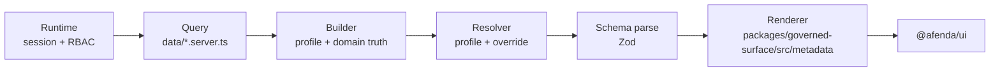

# Governed metadata architecture

**Canonical renderer home:** `packages/governed-surface/src/metadata/`  
**Import doors:** `@afenda/governed-surface/metadata` · narrow `#components2` barrel (renderer + registry only)  
**Schema / profile / resolver home:** `packages/governed-surface/src/`  
**Doctrine:** [Metadata-Driven UI Architecture](metadata-driven-ui-architecture.md) · [Afenda ERP architecture](system-architecture.md)

If this file disagrees with the system architecture or metadata UI architecture docs, follow those documents and update this file in the same change.

**Status:** Architecture direction **sealed** (design **≥ 8.8 / 10**). **Phases 1–7 shipped** on disk (profiles, resolver, builder helpers, schema parse + migration preflight, HRM/org/nexus/orbit list sweep, gallery stat affordances). **Deferred:** `build-governed-chart-surface` until ≥3 modules share chart chrome.

---

## 1. Prime directive

```txt
Metadata declares intent. Runtime owns authority. Renderers compose primitives. Domain owns truth.

Governed metadata must be profile-first.
Builders select profiles and declare domain semantics.
Builders must not repeat visual defaults.
Resolvers merge profile + presentation override only (no RBAC inside generic resolver).
Renderers paint resolved configuration only — no business guessing.
Pages assemble sections; they do not handcraft governed tables or KPI tiles.
```

Afenda is **not** a low-code platform. It is a **governed, server-first declarative UI** system: Zod-validated configuration envelopes, static 1:1 renderer dispatch, and pure server builders. The product shape is semantically closest to **JSON Schema + static renderers** (and admin frameworks like **react-admin** that separate _resource metadata_ from _presentation_), without a client-side JSON-to-JSX interpreter.

---

## 2. Two views of the same stack (do not confuse them)

The governed stack has **six layers**. They are described in two complementary ways:

### 2.1 Authoring model (design-time dependency)

Use this when deciding **where a change belongs** — layer ownership and upgrade propagation:

```txt
Schema → Profile → Resolver → Renderer → Builder → Runtime
         (contract) (DRY ERP patterns) (merge) (paint) (domain truth) (authority)
```

This is **not** request order. It answers: “If we improve exception tables globally, do we edit a profile, a renderer, or 120 builders?”

### 2.2 Execution flow (runtime request order)

Use this when wiring pages, debugging a single request, or onboarding engineers:

```txt
Runtime → Query → Builder → Profile resolver → Zod parse → Renderer → UI primitives
```

| Step                 | What happens                                                                                                                                |
| -------------------- | ------------------------------------------------------------------------------------------------------------------------------------------- |
| **Runtime**          | Session, org, locale, ERP RBAC gates; thin `page.tsx` assembly                                                                              |
| **Query**            | Server-only fetches in `data/*.queries.server.ts`                                                                                           |
| **Builder**          | Selects `presentationProfile`; maps rows/columns/stats; sets `rowTone`, `rowHref`, `cellKind`, `actionId`, optional `presentation` override |
| **Profile resolver** | `resolveGovernedPresentation({ profile, presentation })` → final `presentation` object                                                      |
| **Zod parse**        | `migrateGovernedConfiguration` + `parse*Configuration` — schema is the contract authority                                                   |
| **Renderer**         | `GovernedComponentTree` → registry → `renderers/*.renderer.tsx`                                                                             |
| **UI**               | `@afenda/ui/*` primitives                                                                                                                   |



### 2.3 Canonical responsibility model (sealed)

```txt
Runtime   — session, org, permissions, data, actions
Query     — fetches domain data
Builder   — selects profile; maps domain data to governed metadata; rowTone, rowHref, cellKind, actionId
Profile   — reusable ERP visual defaults (six canonical ids)
Resolver  — merges profile + local presentation override only
Schema    — validates final metadata
Renderer  — paints only
```

**Not** “renderer before builder” in execution — renderer runs **after** the builder and resolver produce validated configuration.

### 2.5 Layer responsibility table

| Layer        | Location                                                                        | Owns                                                                                                  | Must not own                                                        |
| ------------ | ------------------------------------------------------------------------------- | ----------------------------------------------------------------------------------------------------- | ------------------------------------------------------------------- |
| **Schema**   | `packages/governed-surface/src/schemas/`                                        | Allowed metadata contract, `dataNature`, stability, action descriptor shapes                          | Business decisions, fetching, permissions                           |
| **Profile**  | `packages/governed-surface/src/profiles/`                                       | Reusable ERP presentation defaults (table chrome, KPI grid density, toolbar affordances)              | Row-specific truth, tenant/session                                  |
| **Resolver** | `packages/governed-surface/src/resolvers/resolve-governed-presentation.ts`      | Merge `presentationProfile` defaults + local `presentation` override (deep-merge `toolbar` only)      | Visual painting, React, ERP RBAC, permission checks                 |
| **Renderer** | `packages/governed-surface/src/metadata/renderers/`                             | Paint from resolved config; container queries; skeleton parity                                        | Domain queries, IAM, guessing from labels                           |
| **Builder**  | `packages/domain/src/module-list-surfaces.ts` and related domain metadata files | Columns, rows, `rowTone`, `rowHref`, `cellKind`, stat `href`, `trailingAction`, profile **selection** | Repeated `stickyHeader` / `virtualizeRowThreshold` on every surface |
| **Runtime**  | `apps/erp/src/app/**`, Server Actions, route handlers, auth helpers             | Session, org, ERP RBAC, audit, cache tags                                                             | Ad-hoc table markup, viewport breakpoints inside renderers          |

### 2.4 Upgrade decision rule

| Future change                                | Put it where                                                  |
| -------------------------------------------- | ------------------------------------------------------------- |
| All ERP tables should look better            | **Profile** and/or **renderer**                               |
| All exception tables gain export + density   | `erp-exception-table` **profile**                             |
| All KPI cards gain hierarchy / motion policy | `erp-kpi-grid` **profile** + stat **renderer**                |
| FRM critical rows highlighted                | **FRM builder** (`rowTone`)                                   |
| Payroll export needs specific `actionId`     | **Payroll builder** + **runtime** permission gate             |
| All `datetime` cells formatted consistently  | **Renderer** (`list-surface-cell`)                            |
| One mobile capture card                      | **Bespoke island** (Pattern A) — outside governed list kernel |

---

## 3. What lives in `packages/governed-surface/src/metadata/` (this tree)

This directory is the **renderer kernel only**. It does not own Zod schemas, presentation profiles, or domain builders.

| Path                                                                                                                          | Role                                                                                 |
| ----------------------------------------------------------------------------------------------------------------------------- | ------------------------------------------------------------------------------------ |
| [`registry.ts`](../../packages/governed-surface/src/metadata/registry.ts)                                                     | `type` -> renderer id; `AFENDA_GOVERNED_RENDERER_CONTRACTS` (`dataNature`, maturity) |
| [`render-governed-component.tsx`](../../packages/governed-surface/src/metadata/render-governed-component.tsx)                 | Public entry: `GovernedComponentRenderer`                                            |
| [`governed-component-tree.tsx`](../../packages/governed-surface/src/metadata/governed-component-tree.tsx)                     | Parse envelope, registry dispatch, `dataNature` pre-flight                           |
| [`governed-renderer-dispatch.tsx`](../../packages/governed-surface/src/metadata/governed-renderer-dispatch.tsx)               | `renderGovernedRendererById` switch                                                  |
| [`governed-component-skeleton.tsx`](../../packages/governed-surface/src/metadata/governed-component-skeleton.tsx)             | Loading shapes per renderer id                                                       |
| [`renderers/`](../../packages/governed-surface/src/metadata/renderers/)                                                       | One shipped renderer per id (`*.renderer.tsx` + `*.client.tsx` islands)              |
| [`list-surface-with-trailing-column.tsx`](../../packages/governed-surface/src/metadata/list-surface-with-trailing-column.tsx) | Pattern C portal: table + trailing column (not for feature deep-import)              |

**Import allowlist** (ESLint `afenda/components2-metadata-renderer-imports` on `renderers/**`):

- `@afenda/ui/*`
- `@afenda/governed-surface` (schemas, parse helpers — not feature ERP barrels)
- `#i18n/navigation`
- `@afenda/ui/utils`
- `react`, `lucide-react`

**Forbidden in renderers:** `#app-shell`, `#features/<erp-module>`, `react-jsx-parser`, runtime JSON-to-JSX, tenant/session in configuration.

### 3.1 Render pipeline (today)

```txt
GovernedComponentRenderer(props)
  → GovernedComponentTree
      → parseGovernedComponentData (envelope)
      → renderGovernedRendererById
          → e.g. ListSurfaceRenderer
              → prepareGovernedConfigurationForParse (migrateGovernedConfiguration)
              → parseListSurfaceRendererConfiguration (Zod + presentationProfile transform)
              → ListSurfaceTable → list-surface-table.client.tsx
      → AFENDA_GOVERNED_RENDERER_CONTRACTS[dataNature] check (tree pre-flight)
```

**Diagnostics:** `diagnostics: "user" | "operator"` — production stays generic; dev/gallery may use `operator`.

### 3.2 Renderer rules

1. **Container queries** — outermost `@container`; inner layout uses `@sm:` / `@md:` — **no viewport** `sm:`/`md:`/`lg:` for grids inside renderers.
2. **`dataNature`** — enforced per renderer in registry; builders must declare matching nature.
3. **Leaf tiles** — `@afenda/ui/*` (`Card`, `Table`, `Badge`, `Empty`, `Skeleton`) — no raw `<div>` tile geometry.
4. **Paint only** — renderers read **resolved** fields; they do not infer domain meaning:

```ts
// Forbidden in renderers
if (title.includes("Exception")) rowTone = "critical";

// Required
if (row.rowTone === "critical") applyCriticalRowClass();
```

---

## 4. What lives in `packages/governed-surface/src/` (contract + profiles)

### 4.1 Schema layer (shipped)

**Door:** `@afenda/governed-surface` (server) · `@afenda/governed-surface/client` (client-safe)

Authoritative modules today:

| Schema                | File                                                                                                                                                                                                         | Notes                                                                                                                 |
| --------------------- | ------------------------------------------------------------------------------------------------------------------------------------------------------------------------------------------------------------ | --------------------------------------------------------------------------------------------------------------------- |
| List surface          | [`schemas/list-surface-renderer.schema.ts`](../../packages/governed-surface/src/schemas/list-surface-renderer.schema.ts)                                                                                     | `presentation`, `columns`, `rows`, `rowTone`, `rowHref`, `pagination`, responsive `narrowMode`, `primaryColumnId`     |
| List toolbar          | [`schemas/list-surface-toolbar.schema.ts`](../../packages/governed-surface/src/schemas/list-surface-toolbar.schema.ts)                                                                                       | `search`, `filters`, `sort`, `savedView`, `bulkActions`, `export`, `densityToggle`, `columnPicker`                    |
| Stat card             | [`schemas/stat-card.schema.ts`](../../packages/governed-surface/src/schemas/stat-card.schema.ts)                                                                                                             | `href`, `comparison`, `sparkPoints`, `progress`, `density`, `dataNature`                                              |
| Chart                 | [`schemas/chart.schema.ts`](../../packages/governed-surface/src/schemas/chart.schema.ts)                                                                                                                     | `heatmap`, `stacked-bar`, `combo`, brush intent, `actions`, `annotations`, `referenceBands`, `drilldownHref`, `empty` |
| Approval timeline     | [`schemas/approval-timeline.schema.ts`](../../packages/governed-surface/src/schemas/approval-timeline.schema.ts)                                                                                             | compact density, step `href`, `durationLabel`, `metadataChips`                                                        |
| Audit / kanban polish | [`schemas/audit-panel.schema.ts`](../../packages/governed-surface/src/schemas/audit-panel.schema.ts), [`schemas/kanban-board.schema.ts`](../../packages/governed-surface/src/schemas/kanban-board.schema.ts) | actor/status hierarchy, evidence links, card `href`, metadata chips, non-color-only tone cues                         |
| Envelope              | [`schemas/component.schema.ts`](../../packages/governed-surface/src/schemas/component.schema.ts)                                                                                                             | `{ type, serverType, configuration }`                                                                                 |

**Presentation today** (list) — optional object on each builder config:

```ts
presentation?: {
  variant?: "full" | "table-only"
  tableDensity?: "compact" | "comfortable"
  narrowMode?: "table" | "cards" | "auto"
  primaryColumnId?: string
  stickyHeader?: boolean
  virtualizeRowThreshold?: number
  toolbar?: ListSurfaceToolbar
}
```

**Shipped:** optional `presentationProfile` on list/stat configuration input; Zod parse strips profile and merges into `presentation` / `density`. Legacy builders with inline `presentation` only remain valid.

### 4.2 Profile layer (shipped)

**Purpose:** DRY enterprise ERP visual patterns. Change a profile once → every surface that selects it improves.

**Paths:**

```txt
packages/governed-surface/src/
  profiles/
    governed-presentation-profiles.ts   # GOVERNED_LIST_PRESENTATION_PROFILES, GOVERNED_STAT_PRESENTATION_PROFILES
    governed-profile-types.ts
  schemas/
    presentation-profile.schema.ts      # governed profile ids
```

#### Canonical profile set (six — do not proliferate)

| Profile id              | Use when                                            | Resolves to (conceptually)                                                                                                   |
| ----------------------- | --------------------------------------------------- | ---------------------------------------------------------------------------------------------------------------------------- |
| `erp-operational-table` | Standard read-only operational directories          | `table-only`, compact, sticky header, virtualize @ 100, column picker + density                                              |
| `erp-exception-table`   | Exception / inbox / queue surfaces                  | Above + export toolbar slot defaults (builder still supplies `actionId`)                                                     |
| `erp-analytical-table`  | Dense comparison lists in ≥3 unrelated ERP surfaces | Operational table defaults + responsive cards, selection, Decision Ledger affordance; builders supply grouping/summary truth |
| `erp-audit-ledger`      | Audit / history / traceability lists                | Sticky + virtualize + export affordance; `document-lines` nature where applicable                                            |
| `erp-kpi-grid`          | Workbench KPI bands (operational metrics)           | Compact stat density; KPI-friendly layout policy                                                                             |
| `erp-executive-summary` | Low-density snapshot KPI strips                     | Comfortable density; `snapshot-summary` nature                                                                               |

**Profile budget rule (hard):**

```txt
Ship exactly six profile ids. The sixth (`erp-analytical-table`) is justified by TCI exceptions, AAT high-risk absence records, and compliance evidence/register review.
Add another profile only when three or more unrelated modules need the same presentation pattern.
Do not create 30 profiles — that becomes a hidden low-code layout designer.
```

#### Profile contract rule (hard)

Profiles are **not** a second metadata system. They are a const map into schema-approved fields only.

```txt
Profiles may only resolve to fields already defined on listSurfacePresentationSchema,
stat-card configuration, and related toolbar schemas.
Profiles must not introduce keys renderers do not understand.
Profiles must not encode row-level truth (rowTone, rowHref, trailingAction stay on builders).
Profiles must not call requireErpPermission or strip actions — that is runtime/builder authority.
```

Implement profiles as typed partials validated against existing Zod types (or resolved then parsed), not as free-form JSON.

#### Profile naming governance (hard)

Names are **stable enterprise contracts**, not marketing or module labels.

| Allowed                 | Forbidden                                         |
| ----------------------- | ------------------------------------------------- |
| `erp-operational-table` | `frm-premium-table`, `f500-table`, `modern-table` |
| `erp-exception-table`   | `nice-overview`, `v2-table`, `temp-inbox`         |
| `erp-analytical-table`  | `sap-copy`, `retool-table`, `tableau-lite`        |
| `erp-kpi-grid`          | Module-specific visual nicknames                  |

Pattern: `erp-<surface-kind>-<shape>` — boring, searchable, permanent.

### 4.3 Resolver layer (shipped)

**Purpose:** Boring merge of profile defaults + builder `presentation` override. Used by `buildGovernedListSurface` / `buildGovernedStatGrid` and by Zod parse transforms on list/stat schemas.

```ts
// Target API (illustrative)
resolveGovernedPresentation({
  profile: "erp-exception-table",
  presentation: builderOverride, // optional partial
});
// → ListSurfacePresentation (final)
```

**Resolver rules (hard — keep it pure):**

```txt
profile defaults + presentation override = final presentation
Deep-merge toolbar sub-objects; override wins per key.
No ERP RBAC inside the generic resolver (defer module-specific action resolvers).
No inventing keys — unknown fields fail at Zod parse.
```

**Authority stays in runtime/builder** — resolver receives the shape the builder already decided:

```ts
// Builder after runtime permission check — correct
presentation: {
  toolbar: canExport
    ? {
        export: {
          actionId: "hrm.frm.exceptions.export",
          label: copy.exportLabel,
          formats: ["csv"],
        },
      }
    : undefined,
},
```

Do **not** teach `resolveGovernedPresentation` to call `requireErpPermission` or to null out exports by permission matrix. That couples the generic kernel to ERP RBAC and makes testing harder.

**Deferred (explicit):** `resolve-governed-list-actions.ts` or permission-aware resolvers — only if a repeated cross-module pattern emerges; not in v1.

### 4.4 Section primitives (shipped — composition, not renderers)

Pattern wiring lives in governed-surface, not in `packages/governed-surface/src/metadata/`:

| Pattern | Primitive                                                   | Renderer entry                                    |
| ------- | ----------------------------------------------------------- | ------------------------------------------------- |
| **B**   | Manual `Card` + `GovernedComponentRenderer`                 | `@afenda/governed-surface/metadata`               |
| **C**   | `GovernedPatternCListSection`                               | Internal list path + `GovernedTrailingActionSlot` |
| **K**   | `GovernedKanbanFooterSection` / `GovernedKanbanDragSection` | `governed:kanban-board` + client bridge           |

Composition rules are summarized in [Metadata-Driven UI Architecture](metadata-driven-ui-architecture.md).

### 4.5 Builder helpers (shipped)

Thin factories reduce boilerplate while keeping builders declarative:

```txt
packages/governed-surface/src/builders/
  build-governed-list-surface.ts      # profile + columns + rows → merged presentation
  build-governed-stat-grid.ts         # profile + stats → merged density
```

**Public door:** `@afenda/governed-surface` exports `buildGovernedListSurface`, `buildGovernedStatGrid`, `resolveGovernedListPresentation`, `GOVERNED_LIST_PRESENTATION_PROFILES`.

Feature modules keep **domain mapping** in `packages/domain/src/module-list-surfaces.ts` and related domain metadata files; helpers stay generic.

---

## 5. Builder layer — domain truth only

**Location:** `packages/domain/src/module-list-surfaces.ts` and related `packages/domain/src/*metadata.ts` files (server-owned domain mapping).

### 5.1 Correct builder style (target)

```ts
return buildGovernedListSurface({
  surfaceKey: "hrm:field-workforce:exceptions",
  presentationProfile: "erp-exception-table",
  dataNature: "table",
  requiresErpPermission: FRM_READ_PERMISSION,

  columns: [
    { id: "employee", header: copy.colEmployee },
    {
      id: "occurredAt",
      header: copy.colOccurred,
      cellKind: { kind: "datetime" },
    },
    { id: "severity", header: copy.colSeverity, cellKind: { kind: "badge" } },
  ],

  rows: exceptions.map((row) => ({
    id: row.id,
    ...hrmEmployeeListRowLinkFields(orgSlug, row.employeeId, "employee"),
    cells: {
      /* domain strings */
    },
    rowTone: row.severity === "critical" ? "critical" : "default",
    trailingAction: resolveListSurfaceRowTrailingAction(/* ... */),
  })),

  // Override only when necessary
  presentation: {
    toolbar: canExport
      ? { export: { actionId: "...", label: "...", formats: ["csv"] } }
      : undefined,
  },
});
```

**Builder declares:**

- Which **profile** (ERP pattern)
- **Columns** and **cellKind**
- **Rows** and per-row **tone**, **href**, **trailingAction**
- Stat item **href**, **tone**, **comparison** (domain-derived)
- Optional **presentation** overrides

**Builder does not declare** (profile owns):

- `stickyHeader: true` on every table
- `virtualizeRowThreshold: 100` copy-paste
- Default `tableDensity: "compact"` repetition

### 5.2 Anti-pattern (transitional — migrate away)

```ts
// Repeated in 100+ builders today — NOT target architecture
const PRESENTATION = {
  variant: "table-only",
  tableDensity: "compact",
};
```

Current references for profile-first builders:

| Pattern                  | Current reference                                                    |
| ------------------------ | -------------------------------------------------------------------- |
| List profile selection   | `packages/domain/src/module-list-surfaces.ts`                        |
| Record route templates   | `packages/domain/src/record-type-definitions.ts`                     |
| App route section wiring | `apps/erp/src/app/(app)/module-screen.tsx`                           |
| Dashboard wiring         | `apps/erp/src/app/(app)/dashboard-route.tsx`                         |
| Solution Console wiring  | `apps/erp/src/app/(app)/solution-console/solution-console-route.tsx` |

### 5.3 Record drill-down (canonical)

**Door:** `packages/domain/src/record-type-definitions.ts` owns route templates and permissions. `packages/domain/src/module-list-surfaces.ts` maps records and work items into governed row metadata.

| Case                        | Builder pattern                                                                     | Renderer behavior                                                                            |
| --------------------------- | ----------------------------------------------------------------------------------- | -------------------------------------------------------------------------------------------- |
| **Record detail exists**    | `rowHref` from the record type `rowHrefTemplate`                                    | Row becomes navigable; `linkColumnId` selects which cell is treated as the primary link      |
| **Work item detail exists** | `rowHref` points to `/[moduleId]/work-items/[workItemId]`                           | Work-item row re-checks module-scoped auth on the detail route                               |
| **Column-specific link**    | `cellKinds: { [columnId]: { kind: "link", href } }`                                 | Uses the cell-level `href`; avoid row-level links when two cells need different destinations |
| **No stable route**         | Omit `rowHref` and trailing navigation actions                                      | Renderer paints read-only data                                                               |
| **Invalid extension data**  | Keep row visible with attention tone and decision-ledger evidence from domain parse | Renderer never interprets arbitrary JSONB as navigation metadata                             |

**Section contract:** app routes pass server-shaped workspace state into governed sections. Domain builders derive links from route templates and record IDs, while detail routes re-check capability before reading protected rows.

**Current route shape:** `apps/erp/src/app/(app)/[moduleId]/records/[recordId]/page.tsx` and `apps/erp/src/app/(app)/[moduleId]/work-items/[workItemId]/page.tsx`.

**Verification:** `pnpm --filter @afenda/domain test` and `pnpm --filter @afenda/erp typecheck`.

### 5.4 Workbench `?focus=` search (exception / pending inboxes)

**Kernel:** `packages/governed-surface/src/builders/governed-list-toolbar.shared.ts`

| Piece   | Responsibility                                                                                                          |
| ------- | ----------------------------------------------------------------------------------------------------------------------- |
| Route   | `searchParamFirst(resolvedSearchParams, "focus")` on `page.tsx` → `workbenchFocus` prop                                 |
| Section | `matchesGovernedWorkbenchFocus(focus, …haystacks)` filters rows **before** builder                                      |
| Builder | `presentationProfile: "erp-exception-table"` + `governedWorkbenchFocusPresentationPatch({ label, placeholder, value })` |
| Client  | `ListSurfaceToolbarClient` syncs `GOVERNED_WORKBENCH_SEARCH_PARAM_KEYS.focus` on the URL                                |

**Do not** filter unrelated streams (e.g. TCI correction workflow) with exception-row haystacks. Bulk toolbars and trailing `context` must use the **same filtered row set** as the list configuration.

**Gold references:** `leave-pending-inbox.tsx` · `claim-pending-inbox.tsx` · `otm-pending-inbox.tsx` · `geolocation-pending-section.tsx`.

---

## 6. Runtime layer

**Location:** `apps/erp/src/app/**`, layouts, Server Actions, and Route Handlers.

```txt
page.tsx
  → await params (+ searchParams when used)
  → resolve server session / organization context
  → Promise.all(queries + translations + permission probes)
  → app RSC sections (pass server-shaped workspace state and access flags)
  → GovernedComponentRenderer | GovernedPatternCListSection
```

Runtime owns:

- **Who** can see the surface (layout gates)
- **What data** exists (queries)
- **Which actions** are allowed (ERP RBAC → builder omits or disables `trailingAction` / toolbar.export)
- **Audit** `actionId` strings on export and mutations

Renderers, profiles, and the **generic resolver** never call `requireErpPermission`. The **builder** (after runtime gates) omits or supplies `toolbar.export`, `trailingAction`, and row actions — then the resolver only merges presentation shape.

**Rules:** follow the App Router runtime rules in [Metadata-Driven UI Architecture](metadata-driven-ui-architecture.md) and Vercel React best practices for async waterfalls and RSC serialization.

### 6.1 Next.js App Router contract (governed ERP pages)

| Concern                | Do                                                                                                                            | Do not                                                                                   |
| ---------------------- | ----------------------------------------------------------------------------------------------------------------------------- | ---------------------------------------------------------------------------------------- |
| **Page thickness**     | `page.tsx` ≤ guards + `Promise.all` + section composition                                                                     | Domain queries, Zod, builder maps, or table markup in `app/`                             |
| **Async request APIs** | `await params`, `await searchParams`, `await cookies()` in pages/layouts/actions                                              | Sync access to dynamic segment props                                                     |
| **Data fetching**      | Parallelize independent server reads: `Promise.all([listQuery(), getTranslations(), resolvePermission()])`                    | Sequential awaits when queries do not depend on each other                               |
| **Initial list truth** | Builder runs in RSC section or `data/*.server.ts`; pass **configuration** to `GovernedPatternCListSection`                    | `useEffect` + `useState` copying server rows; TanStack Query for first paint             |
| **Client import door** | `GovernedTrailingActionSlot`, kanban bridges from `@afenda/governed-surface/client`                                           | `@afenda/governed-surface` index from `"use client"` when index re-exports server graphs |
| **Pattern C boundary** | `trailingColumn.cellId` + registered **Client Component** `Cell`                                                              | `trailingColumn.render` (functions are not serializable across RSC → client)             |
| **Locale paths**       | `rowHref` / cell `href` = org-internal paths (`/o/{orgSlug}/apps/...`); client `Link` from `#i18n/navigation` prefixes locale | Hard-coded `/en/o/...` in builders; bare `/o/...` in server `redirect()`                 |
| **Tenant authority**   | `organizationId` from `requireOrgSession` / `getOrgTenantContext` only                                                        | `organizationId` from `FormData`, query strings, or client props                         |
| **Mutations**          | Server Actions + `revalidatePath(toLocaleOrgAppsRevalidatePattern("/hrm/..."), "page")`                                       | Route handlers for internal ERP list mutations                                           |
| **Loading**            | Route `loading.tsx` + section `loadError` / renderer empty states                                                             | Client-only spinners that hide missing server empty handling                             |

**Thin page recipe:**

```ts
export default async function HrmModulePage({
  params,
}: {
  params: Promise<{ locale: string; orgSlug: string }>
}) {
  const { locale, orgSlug } = await params
  const session = await requireOrgSession()
  const [rows, t, canRead] = await Promise.all([
    listRowsForOrg(session.organizationId),
    getTranslations("Hrm.Module"),
    resolveGovernedErpPermissionAllowed({ /* … */ }),
  ])
  return (
    <ModulePage>
      <HrmListSection orgSlug={orgSlug} locale={locale} rows={rows} canRead={canRead} copy={t} />
    </ModulePage>
  )
}
```

**Section recipe:** receive `orgSlug` from the page → pass into `build*ListSurfaceConfiguration(rows, orgSlug, copy)` → pass configuration to `GovernedPatternCListSection` (no re-parse in the section).

### 6.2 Vercel React performance (governed surfaces)

Prioritized rules from [Vercel React Best Practices](https://github.com/vercel-labs/agent-skills/tree/main/skills/react-best-practices) mapped to this stack:

| Priority     | Rule                               | Afenda application                                                                                                                                                                                       |
| ------------ | ---------------------------------- | -------------------------------------------------------------------------------------------------------------------------------------------------------------------------------------------------------- |
| **CRITICAL** | `async-parallel`                   | Page and RSC section: batch queries + i18n + permission probes in one `Promise.all`                                                                                                                      |
| **CRITICAL** | `bundle-barrel-imports`            | Builders import `#features/hrm/hrm-employee-list-surface-rows.shared` (or module-relative `.shared`) — not the HRM `index.ts` from hot paths that pull server-only graphs into accidental client bundles |
| **HIGH**     | `server-serialization`             | Pass `ListSurfaceRendererConfigurationInput` (or builder output) to client bridges — not raw Drizzle rows + re-map on the client                                                                         |
| **MEDIUM**   | `rerender-derived-state-no-effect` | Row selection, filters, and trailing dialog state stay local; do not mirror server `rows` into client state after hydration                                                                              |
| **MEDIUM**   | `bundle-dynamic-import`            | Heavy kanban/chart client bridges behind `next/dynamic` when a section is below the fold or tab-gated                                                                                                    |
| **MEDIUM**   | `rerender-memo`                    | Expensive trailing cells: keep as focused client islands; avoid re-rendering the full table when one dialog opens                                                                                        |

**Cache Components:** use `'use cache'` + `cacheLife` / tags on read models where the module already defines tags; after Server Actions prefer `updateTag` when the UI must not flash stale list metadata.

**Anti-patterns (block merge on review):**

```txt
Waterfall: await getSession(); await listA(); await listB() when B does not need A
Client island owns initial ERP list rows (useQuery seed from empty → fetch duplicates RSC)
Passing trailingColumn.render or Server Action arrays inside metadata configuration
Importing #features/<module> from *.client.tsx when index.ts exports server sections
```

---

## 7. Disk truth vs target (2026-05)

| Capability                                           | Status                          | Where                                                                                            |
| ---------------------------------------------------- | ------------------------------- | ------------------------------------------------------------------------------------------------ |
| Zod schemas + `dataNature`                           | **Shipped**                     | `packages/governed-surface/src/schemas/`                                                         |
| TanStack list + virtual rows + toolbar               | **Shipped**                     | `packages/governed-surface/src/metadata/renderers/list-surface-*`                                |
| Stat href / comparison / sparkline / progress        | **Shipped** (schema + renderer) | Adoption uneven in builders                                                                      |
| Chart heatmap                                        | **Shipped**                     | `chart-heatmap-body.client.tsx`                                                                  |
| Presentation profiles (six ids)                      | **Shipped**                     | `profiles/governed-presentation-profiles.ts`                                                     |
| `resolveGovernedListPresentation` / stat density     | **Shipped**                     | `resolvers/resolve-governed-presentation.ts`                                                     |
| `presentationProfile` on list/stat parse             | **Shipped**                     | `list-surface-renderer.schema.ts`, `stat-card.schema.ts`                                         |
| `buildGovernedListSurface` / `buildGovernedStatGrid` | **Shipped**                     | `builders/`                                                                                      |
| Builders profile-first                               | **Done (v1 sweep)**             | Kernel + mass HRM/org/nexus/tools migration; `RECRUITMENT_TABLE_PRESENTATION` shared helper only |

**Platform maturity:** kernel CI and registry coverage are implemented through package tests and `pnpm architecture:check`.  
**Enterprise presentation:** renderer capability is strong; remaining gaps are selective builder adoption and route-level visual QA.

**Important correction:** Enterprise renderer **capabilities** are largely shipped; the product still looks plain when builders emit **minimal** `presentation` and omit `href` / `rowTone` / `toolbar`. Profile-first architecture fixes the **DRY** problem; builders still supply **domain truth** profiles cannot guess.

---

## 8. Recommended file structure (target)

```txt
packages/governed-surface/src/
  schemas/
    list-surface-renderer.schema.ts      # + presentationProfile optional field
    stat-card.schema.ts
    chart.schema.ts
    presentation-profile.schema.ts       # enum of profile ids
  profiles/
    governed-presentation-profiles.ts    # GOVERNED_PRESENTATION_PROFILES
    governed-profile-types.ts
  resolvers/
    resolve-governed-presentation.ts       # profile + override merge only (v1)
  builders/
    build-governed-list-surface.ts
    build-governed-stat-grid.ts
    build-governed-chart-surface.ts
  components/                            # Pattern A/B/C/K section primitives (shipped)
  data/                                  # trailing action resolve (shipped)
  index.ts · client.ts · server.ts

packages/governed-surface/src/metadata/
  registry.ts
  render-governed-component.tsx
  governed-component-tree.tsx
  renderers/
    list-surface.renderer.tsx
    stat-card.renderer.tsx
    chart.renderer.tsx
    ...

packages/domain/src/
  module-list-surfaces.ts                # domain truth + profile id only
  record-type-definitions.ts             # route templates, columns, permissions

apps/erp/src/app/(app)/[moduleId]/
  page.tsx                               # thin assembly only
  records/[recordId]/page.tsx            # protected detail route
  work-items/[workItemId]/page.tsx       # protected work-item detail route
```

---

## 9. Propagation model

```txt
Profile / renderer upgrade
  → every route whose builder selects that profile OR relies on renderer defaults for existing cellKinds

New schema field (e.g. sparkPoints)
  → requires one builder/data pass per surface that should show sparklines

Bespoke Pattern A island (forms, mobile capture)
  → does not auto-upgrade; intentional exclusion from the governed list/stat kernel
```

**One list renderer PR** upgraded all Pattern B/C tables that pass `stickyHeader` / `virtualizeRowThreshold`. **Profile-first** means future table chrome upgrades do not require touching 120 HRM builder files.

---

## 10. Verification and governance

| When you touch…                                       | Run                                                                               |
| ----------------------------------------------------- | --------------------------------------------------------------------------------- |
| `packages/governed-surface/src/metadata/renderers/**` | `pnpm lint:governed-renderers` and `pnpm --filter @afenda/governed-surface test`  |
| `packages/governed-surface/src/schemas/**`            | `pnpm --filter @afenda/governed-surface test` and `pnpm typecheck`                |
| Domain builders or record metadata                    | `pnpm --filter @afenda/domain test` and `pnpm --filter @afenda/erp typecheck`     |
| App route behavior                                    | `pnpm --filter @afenda/erp typecheck` and `pnpm test:e2e` when navigation changes |
| Architecture or docs                                  | `pnpm architecture:check` and targeted Prettier checks on edited docs             |

Renderer gallery routes are deferred unless a concrete `apps/erp/src/app` route exists.

---

## 11. Handcrafted exclusions (permanent)

Do not force governed metadata on:

- Route-specific landing clear bars, truth maps, or attention strips
- Route-specific queue or triage handcrafted cards
- Lynx machine layer
- Org chart (`@xyflow/react`), leave calendars, mobile one-off capture panels

Lists on the **same page** as those islands should still use Pattern B/C where applicable.

---

## 12. Implementation roadmap (ordered)

| Phase                    | Status   | Deliverable                                                                                                                                            |
| ------------------------ | -------- | ------------------------------------------------------------------------------------------------------------------------------------------------------ |
| **1 — Contract**         | **Done** | `presentationProfile?` on list/stat input; parse strips profile after merge                                                                            |
| **2 — Profiles**         | **Done** | `GOVERNED_LIST_PRESENTATION_PROFILES`, `GOVERNED_STAT_PRESENTATION_PROFILES`                                                                           |
| **3 — Resolver**         | **Done** | `resolve-governed-presentation.ts` (pure merge, no RBAC)                                                                                               |
| **4 — Builder helpers**  | **Done** | `buildGovernedListSurface`, `buildGovernedStatGrid`                                                                                                    |
| **5 — Pilot (FRM)**      | **Done** | `frm-surface-builders.server.ts` — operational/exception profiles, `rowTone` on exceptions/travel                                                      |
| **6 — Gallery fixtures** | **Done** | `stat-card-affordances` scenario (`href`, `comparison`, `sparkPoints`, `progress`)                                                                     |
| **7 — HRM sweep**        | **Done** | List builders use `buildGovernedListSurface` + profiles; stat grids use `buildGovernedStatGrid`; export toolbars pass `presentation` partial overrides |

### After pilot

| Work                  | When                                                                                                                 |
| --------------------- | -------------------------------------------------------------------------------------------------------------------- |
| **Renderer** tweaks   | Only if merged presentation exposes a gap (e.g. global `datetime` cell formatting)                                   |
| **HRM mass adoption** | Sweep builders by profile kind — not by copying `stickyHeader` blocks                                                |
| **Architecture docs** | Keep this document and [Metadata-Driven UI Architecture](metadata-driven-ui-architecture.md) aligned with code truth |
| **New profile id**    | Only when ≥3 modules share a pattern not covered by the six shipped profiles                                         |

---

## 15. Quality evaluation & gaps closed (2026-05)

Use **two scores** — do not conflate platform CI maturity with operator presentation.

| Rubric                          | Status             | Current source of truth                                      |
| ------------------------------- | ------------------ | ------------------------------------------------------------ |
| Kernel maturity                 | Shipped            | package tests and `pnpm architecture:check`                  |
| Enterprise presentation         | Strong, selective  | renderer capability shipped; builder adoption remains uneven |
| Architecture design             | Stable             | this document + metadata UI architecture                     |
| Architecture as-built alignment | Guarded and active | `scripts/check-directory-architecture.mts`                   |

### Gap register (architecture → codebase)

| Gap (evaluation)                                                   | Resolution                                                                                                                                               |
| ------------------------------------------------------------------ | -------------------------------------------------------------------------------------------------------------------------------------------------------- |
| Profiles/resolver not on disk                                      | **Closed** — §4.2–4.5, `tests/unit/governed-surface/resolve-governed-presentation.test.ts`                                                               |
| Builders repeat `PRESENTATION`                                     | **Closed** — Phase 7 profile-first sweep                                                                                                                 |
| Parse path did not merge profiles                                  | **Closed** — Zod transform on list/stat schemas                                                                                                          |
| SAP/Salesforce/Retool analytical table gap                         | **Closed (kernel)** — `erp-analytical-table`, selection, grouping, summary footer, column ergonomics, filter chips, and Decision Ledger renderer support |
| Gallery missing stat affordance scenarios                          | **Closed** — `GALLERY_STAT_CARD_AFFORDANCES` + `stat-card-affordances` gallery scenario                                                                  |
| Maturity doc stale enterprise baseline                             | **Closed** — footnote points to enterprise scorecard (~8.3)                                                                                              |
| `build-governed-chart-surface`                                     | **Deferred** — chart profiles only when ≥3 modules share chart chrome                                                                                    |
| `migrateGovernedConfiguration` not on parse path                   | **Closed** — `prepareGovernedConfigurationForParse` in list/stat `parse*`                                                                                |
| Residual inline `presentation: { variant: "table-only" }` builders | **Closed** — offboarding, skills, orbit lists, candidate portal careers (2026-05-23)                                                                     |

### Plan vs codebase completeness (2026-05-23 audit)

| Layer                                                     | Planned (this doc) | On disk                                                                                                                 | Gap                                                                                                                       |
| --------------------------------------------------------- | ------------------ | ----------------------------------------------------------------------------------------------------------------------- | ------------------------------------------------------------------------------------------------------------------------- |
| Four list profiles + two stat profiles                    | §4.2               | `governed-presentation-profiles.ts`                                                                                     | **None** — `erp-analytical-table` covers dense comparison + Decision Ledger; export `actionId` stays builder override     |
| `resolveGovernedPresentation`                             | §4.3               | `resolve-governed-presentation.ts` + unit tests                                                                         | **None**                                                                                                                  |
| `buildGovernedListSurface` / `buildGovernedStatGrid`      | §4.5               | `builders/*.ts`                                                                                                         | **None**                                                                                                                  |
| Zod `presentationProfile` transform                       | Phase 1            | `list-surface-renderer.schema.ts`, `stat-card.schema.ts`                                                                | **None**                                                                                                                  |
| Parse-time schema migration                               | §3.1 pipeline      | `prepareGovernedConfigurationForParse`                                                                                  | **None** (list + stat)                                                                                                    |
| Registry + shipped renderers                              | Renderer contract  | `registry.ts`, `renderers/**`                                                                                           | **None** for production ERP list/stat/chart/kanban                                                                        |
| Gallery `stat-card-affordances`                           | Phase 6            | `gallery-scenarios.ts`, `GALLERY_STAT_CARD_AFFORDANCES`                                                                 | **None**                                                                                                                  |
| ERP list builders on profiles                             | Phase 7            | ~70+ `buildGovernedListSurface` call sites                                                                              | **None** for list builders; candidate portal stats use `buildGovernedStatGrid` + `erp-executive-summary`                  |
| Chart builder helper                                      | §8 target tree     | Not created                                                                                                             | **Deferred** (YAGNI)                                                                                                      |
| Enterprise affordance adoption                            | §14                | Uneven builder adoption of toolbar v2, chart context, and stat `comparison` / `href` outside priority surfaces          | **Partial** — metadata kernel supports the fields; remaining work is profile-first builder rollout on secondary modules   |
| Affordance polish PR1 (`rowHref` employee drill-down)     | §5.3               | `hrm-employee-list-surface-rows.shared.ts` + FRM/FHC/FWA/SFT/LMS + wave 1–2 modules                                     | **Closed** (2026-05-23)                                                                                                   |
| Affordance polish PR2 (`rowTone` + row links)             | Product plan       | exception/filing tones; `hrmGovernedListRowLinkFields` (evidence UUID → compliance detail, else employee)               | **Closed** — non-UUID fixture ids still omit `rowHref` (correct)                                                          |
| Affordance polish PR3 (stat `href` / section anchors)     | Product plan       | FHC, FRM, FWA, geo, AAT stat grids + section `id` anchors; engagement index KPI → `#engagement-category-scores-section` | **Closed** for plan scope; payslip stat `href` deferred (no prior-period comparison data)                                 |
| Optional explicit `__schemaVersion` on every builder call | §3.1               | Parse migrator + builder stamp                                                                                          | **Closed** — `buildGovernedListSurface` / `buildGovernedStatGrid` default `GOVERNED_METADATA_SCHEMA_VERSION` when omitted |

**Pattern C trailing column (RSC):** Server sections must pass a **Client Component** as `trailingColumn.Cell` (or `cellId: "governed.metadata"`) — never `trailingColumn.render` (functions are not serializable). See `governed-pattern-c-trailing-column.shared.ts` and `governed-list-trailing-cell-registry.client.ts`. Full runtime rules: **§6.1–6.2**.

**Runtime audit:** use a local Next.js dev server (`pnpm dev`) for browser verification when route behavior changes; static verification uses package tests and typecheck.

### Builder migration checklist (per module)

1. Replace `const PRESENTATION = { variant: "table-only", … }` with `buildGovernedListSurface({ presentationProfile: "erp-operational-table" | "erp-exception-table" | "erp-analytical-table" | "erp-audit-ledger", … })`.
2. Exception/inbox lists: `erp-exception-table`; dense comparison/evidence review lists: `erp-analytical-table`; add `presentation.toolbar.export` override only when runtime allows export (real `actionId`).
3. KPI bands: `buildGovernedStatGrid({ presentationProfile: "erp-kpi-grid", dataNature: "kpi", … })` + per-stat `href` / `comparison` (domain).
4. Snapshot strips: `erp-executive-summary`.
5. Keep **domain-only** on rows: `rowTone`, `rowHref` / `cellKinds` link `href`, `cellKind`, `trailingAction`.
6. HRM employee column: follow **§5.3** (`orgSlug` on builder + section).
7. Runtime: **§6.1** (`Promise.all`, serializable Pattern C `Cell`, locale-safe hrefs).
8. Run `pnpm --filter @afenda/domain test` and `pnpm --filter @afenda/erp typecheck`.

---

## 13. Related documents

| Document                                                              | Topic                                                |
| --------------------------------------------------------------------- | ---------------------------------------------------- |
| [System Architecture](system-architecture.md)                         | Product-wide runtime, deployment, data, and AI       |
| [Metadata-Driven UI Architecture](metadata-driven-ui-architecture.md) | Runtime authority and metadata contracts             |
| [Directory Architecture Audit](directory-architecture-audit.md)       | Monorepo boundaries and architecture guards          |
| [Naming Conventions](naming-conventions.md)                           | Directory, file, component, and documentation naming |

---

## 14. Summary

**Authoring model (where to edit):**

```txt
Schema → Profile → Resolver → Renderer → Builder → Runtime
```

**Execution flow (one request):**

```txt
Runtime → Query → Builder → Profile resolver → Zod parse → Renderer
```

**Sealed responsibilities:**

```txt
Runtime   = session, org, permissions, data, actions
Query     = domain fetches
Builder   = profile selection + domain truth (rows, tones, hrefs, actionIds)
Profile   = six canonical ERP visual defaults (grow only with ≥3-module repetition)
Resolver  = profile + presentation override merge only (no RBAC)
Schema    = validates final metadata
Renderer  = paint only (packages/governed-surface/src/metadata)
```

**`packages/governed-surface/src/metadata/`** is the **paint layer** — last in the execution chain, not first in design discussions.

Fortune 500 operator quality needs **profiles + builders + existing renderers**: renderers cannot guess business semantics; builders must not repeat visual defaults. **Profile-first governed metadata** (Phases 1–7) is shipped; renderer kernel (TanStack list, Number Flow stat, heatmap/combo/brush chart, toolbar v2, responsive cards, analytical table controls, Decision Ledger) is live. The remaining lift to **9.5** is primarily **builder affordance adoption** (`href`, `comparison`, `rowTone`, toolbar descriptors, chart annotations/actions, decision evidence) plus screenshot and axe regression coverage, not duplicate table JSX.
