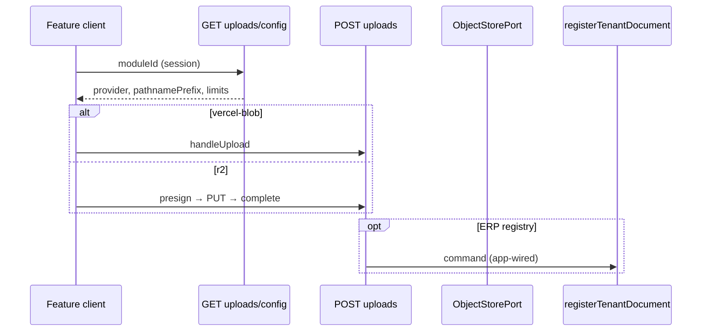

# Object Storage & Document Evidence Architecture

| Field | Value |
| ----- | ----- |
| **Architecture code** | ARCH-OS-1001 |
| **Domain classification** | Platform infrastructure |
| **Parent architecture** | [ARCH-1002](../../../docs/architecture/1002-backend.md) · [ARCH-1004](../../../docs/architecture/1004-api.md) · [ARCH-1005](../../../docs/architecture/1005-infrastructure.md) §10.2 |
| **Maturity target** | Enterprise production (9.5/10) |
| **Technical foundation (as-built)** | ≈9.2/10 — provider port, dual backend, tenancy gates, layout law, governance hooks, lifecycle sweeps, metadata-driven document surfaces |
| **Package** | `@afenda/object-storage` |
| **Operator guide** | `packages/object-storage/AGENTS.md` |
| **Module document meaning** | [`documents-management-architecture.md`](../../../features/hr-suite/src/employee-management/documents-management/documents-management-architecture.md) (HR vault — verification, retention UI, audit surfaces) |

---

# 1. Executive decision

Afenda shall treat every uploaded file as **governed business evidence**, not as anonymous blob storage.

Object storage exists to provide:

- secure evidence ingestion
- evidence preservation (bytes at rest)
- evidence retrieval (authorized download)
- evidence movement governance (provider-agnostic transport)
- hooks for evidence auditability (events emitted to the audit ledger)

**Separation of concerns (non-negotiable):**

| Layer | Owns |
| ----- | ---- |
| **ERP feature modules** | Document *meaning* — classification business rules, verification, retention policy, legal hold workflow, HR vault, readiness |
| **`@afenda/object-storage`** | Document *movement* — upload/download ingress, pathname discipline, provider port, signed URLs |
| **Execution audit / audit ledger** | Document *evidence* — immutable `DOCUMENT_*` (and module-specific) audit events with actor, org, timestamp |
| **`@afenda/db`** | Document *registry* — `erp_documents`, HR document rows, retention class column |

The platform shall **never** expose provider-specific implementation details to ERP modules. Features import `@afenda/object-storage` doors only — not `@vercel/blob`, not `@aws-sdk/client-s3`.

---

# 2. Enterprise control objectives

| ID | Objective | Requirement | As-built |
| -- | --------- | ----------- | -------- |
| **ECO-01** | Tenant isolation | No tenant may view, download, enumerate, overwrite, or delete another tenant's objects. | **Partial** — pathname prefix + session org + module/document capabilities **Shipped**; R2 object metadata on PUT **Shipped**; Vercel Blob relies on pathname + registry |
| **ECO-02** | Evidence integrity | Evidence traceable from creation through destruction. | **Partial** — ERP + HR registry lifecycle, byte purge, and `DOCUMENT_DELETED` / `DOCUMENT_RETENTION_EXPIRED` audit **Shipped**; external AV quarantine **Future** |
| **ECO-03** | Access accountability | Every evidence access attributable to user, org, module, timestamp, action. | **Partial** — session auth on routes **Shipped**; HR document mutations **Shipped**; platform `DOCUMENT_UPLOADED` / `DOCUMENT_DOWNLOADED` → execution audit **Shipped** (app adapter) |
| **ECO-04** | Provider independence | Storage provider replacement without feature-module code changes. | **Shipped** — `ObjectStorePort`, `blob/` + `r2/` slices, env-selected provider |
| **ECO-05** | Compliance readiness | ISO 27001, SOC 2, GDPR, PDPA (MY/SG) support without redesign. | **Target** — architecture reserves classification, retention, legal hold, BYOK; controls below marked Shipped / Partial / Future |

---

# 3. Architecture context

```txt
Feature Modules (document meaning, verification, retention)
      │
      ▼
@afenda/object-storage  ← ARCH-OS-1001 (movement + ingress governance)
      │
      ▼
ObjectStorePort
      │
 ┌────┴────┐
 │         │
 ▼         ▼
vercel-blob   r2
```

Features never communicate with providers directly. HTTP ingress is **ARCH-1004** internal v1 only (`POST /api/internal/v1/uploads`, `GET …/uploads/config`, `GET …/documents/[id]/download`).

---

# 4. Evidence lifecycle

A document is **not trusted immediately after upload**. Target lifecycle:

```txt
Created → Uploaded → Virus Scanned → Verified → Active → Archived → Legal Hold → Destroyed
```

| Stage | Owner | As-built |
| ----- | ----- | -------- |
| Uploaded (bytes in store) | `@afenda/object-storage` | **Shipped** |
| Registered (ERP row) | `registerUploadedTenantDocumentCommand` → `@afenda/db` | **Shipped** (optional per upload) |
| Pending scan / scanning / passed | Platform security pipeline | **Partial** — async scan queue + cron sweep + external AV webhook **Shipped**; dedicated AV vendor integration **Operator** (env `DOCUMENT_AV_API_URL`) |
| Verified / rejected / expired | `@afenda/feature-hr-suite` documents-management | **Shipped** (HR workbench) |
| Active / archived | HR + `erp_documents.retentionClass` | **Partial** — `standard` \| `short-term` \| `legal-hold` on ERP row; HR retention policies UI **Shipped**; `retention_days` applied on HR register when `effectiveTo` omitted **Shipped**; `archive_on_separation` enforced on employee archive **Shipped** |
| Legal hold / destruction | Feature commands + audit ledger | **Partial** — registry delete + object byte purge **Shipped** (ERP); HR archived destruction sweep + byte purge **Shipped**; module registry lifecycle actions **Shipped**; retention expiry cron sweep **Shipped** (ERP `short-term` + HR archive + HR destruction) |

---

# 5. Document classification

Every governed document must belong to a **classification** that drives retention, permissions, download controls, audit level, and future encryption policy.

| Classification | Examples | Platform / module |
| -------------- | -------- | ----------------- |
| Public | Marketing assets | `access: public` on store (R2 requires public URL base) |
| Internal | SOPs | HR enum `internal` |
| Confidential | Employee files | HR enum `confidential` |
| Restricted | Payroll | HR enum `restricted` |
| Highly restricted | Medical records | Platform enum **Shipped**; module policy enforcement **Partial** |
| Regulated | Tax, statutory | Platform enum **Shipped**; cross-module taxonomy enforcement **Partial** |

**As-built:** HR employee documents use `hr_document_classification` (`internal`, `confidential`, `restricted`) with sensitive read masking. ERP registry uses `erp_documents.classification` + `retentionClass` columns (migration 0047).

**Target (ARCH-OS-1001):** classification propagated to all provider objects (R2 **Shipped**; Blob pathname + registry) and download Layer 4 checks for all modules (**Shipped** — ERP registry modules via `{moduleId}.documents.sensitive.read` capabilities in `@afenda/auth`; HR + system-admin security read unchanged).

---

# 6. Tenant isolation model

## 6.1 Pathname rule (necessary)

```txt
tenants/{organizationId}/{moduleId}/...
```

**Shipped:** server-built prefix; `assertUploadPathnameMatchesTenant`; random suffix for collision safety (`addRandomPathSuffix`).

## 6.2 Storage layer (insufficient alone — required)

Every object must carry ownership metadata (target):

```txt
organizationId
moduleId
classification
uploadedBy
```

**Shipped (R2):** S3 object `Metadata` on presigned PUT — `organizationId`, `moduleId`, `classification`, `uploadedBy`.

**Shipped (Vercel Blob):** pathname discipline + ERP registry columns; `tokenPayload` round-trip on presign/`handleUpload` + `addRandomSuffix: true` (no S3-style object tags).

## 6.3 Download layer (required)

Every download must validate:

```txt
document tenant  =  session tenant
module permission
classification permission  (Partial at platform ingress — **Shipped** hook + HR/system-admin capability; Partial in HR vault)
```

**Shipped:** session org, module capability, `hasDocumentReadAccess`, injected `getTenantDocument`, pathname match.

---

# 7. Access control model

Four layers — all required for 9.5 maturity.

| Layer | Control | As-built |
| ----- | ------- | -------- |
| **1** | Authenticated session | **Shipped** — `getSession()` on upload/download |
| **2** | Organization membership | **Shipped** — `getActiveOrganization(session)`; never client-supplied org as source of truth |
| **3** | Module capability | **Shipped** — `requireUploadModuleAccess`, document read/write capabilities |
| **4** | Document classification permission | **Shipped** — HR sensitive read/write + list masking **Shipped**; platform download `authorizeDocumentDownload` **Shipped**; HR vault resolves via composite `getTenantDocumentForDownload` (`moduleId=hr`) |

Example (HR — meaning layer):

```txt
Employee record document — HR Admin: Allow · HR Manager: Allow · Payroll Admin: Allow · Supervisor: Deny
```

---

# 8. Upload security architecture

## Before upload token / presign

| Check | As-built |
| ----- | -------- |
| Session | **Shipped** |
| Organization | **Shipped** |
| Module + document write capability | **Shipped** |
| Max size (25 MB) | **Shipped** — `document-upload-policy.shared.ts` |
| MIME allowlist | **Shipped** |

## After upload

| Check | As-built |
| ----- | -------- |
| Pathname matches tenant prefix | **Shipped** |
| Actual object size (R2 complete) | **Shipped** — `HeadObject` |
| Actual content type vs declared | **Partial** — R2 presign binds `ContentType`; magic-byte verification on R2 complete + Blob callback **Shipped** (fail-closed when prefix fetch fails) for PDF/PNG/JPEG/WebP |

---

# 9. Malware protection

Enterprise ERP assumes uploads may be hostile.

**Target pipeline:**

```txt
Uploaded → Pending Scan → Scanning → Passed → Available
```

If malware detected: `Quarantined → Security Review → Delete`. Downloads prohibited until scan passed.

**As-built:** **Shipped** — download blocked until `scan_status === "passed"` (`assertDocumentScanPassed`); async pipeline (`pending` → `scanning` → terminal status) with cron sweep (`document-scan-sweep`, every 30 min) and webhook callback (`POST …/webhooks/document-scan-result`); built-in object-presence scan when `DOCUMENT_AV_API_URL` unset; external HTTP AV worker via signed download URL (operator-configured); module registry trailing **Approve release** for `failed`/`quarantined` rows (`DOCUMENT_SCAN_QUARANTINE_RELEASED`); dedicated quarantine inbox in System Admin Security (`loadSystemAdminDocumentQuarantineInboxWindow`).

**Production readiness gate:** malware scanning must be enabled before 9.5 sign-off (§20).

---

# 10. Audit evidence architecture

Immutable audit events are owned by the **execution audit ledger**, not by object-storage log lines.

## Target event types

| Action | Event |
| ------ | ----- |
| Upload | `DOCUMENT_UPLOADED` |
| Download | `DOCUMENT_DOWNLOADED` |
| Delete | `DOCUMENT_DELETED` |
| Download denied | `DOCUMENT_DOWNLOAD_DENIED` |
| Upload denied | `DOCUMENT_UPLOAD_DENIED` |
| Legal hold | `DOCUMENT_LEGAL_HOLD_APPLIED` |
| Legal hold released | `DOCUMENT_LEGAL_HOLD_RELEASED` |
| Org hold cascade | `DOCUMENT_ORG_LEGAL_HOLD_CASCADED` |
| Scan quarantine released | `DOCUMENT_SCAN_QUARANTINE_RELEASED` |
| Retention expiry | `DOCUMENT_RETENTION_EXPIRED` |
| Malware detected | `DOCUMENT_MALWARE_DETECTED` |

## Target payload shape

```json
{
  "organizationId": "",
  "documentId": "",
  "pathname": "",
  "classification": "",
  "userId": "",
  "action": "",
  "timestamp": "",
  "sourceIp": "",
  "sessionId": ""
}
```

**As-built:**

| Surface | Status |
| ------- | ------ |
| HR document mutations (upload, download, verify, reject, replace, archive, …) | **Shipped** — module audit in documents-management |
| Platform `logServerEvent` on upload/download routes | **Shipped** — observability only, not immutable ledger |
| Platform `DOCUMENT_UPLOADED` / `DOCUMENT_DOWNLOADED` on ingress | **Shipped** — `recordTenantDocumentEvidenceEvent` → `writeExecutionAuditEvent` at app route via `@afenda/feature-system-admin` |

Object-storage remains free of `@afenda/db`; audit writes happen in the app adapter or feature command after handler success.

---

# 11. Retention and legal hold

| Document type | Target retention |
| ------------- | ---------------- |
| Payroll | 7 years |
| Tax | 7 years |
| Employment | Employment + 7 years |
| Contracts | Contract + 7 years |
| Audit evidence | Permanent |

**Legal hold supersedes retention.** Documents under legal hold cannot be deleted.

**As-built:** `erp_documents.retentionClass` includes `legal-hold`; per-document apply/release via module registry trailing actions (`DOCUMENT_LEGAL_HOLD_APPLIED` / `DOCUMENT_LEGAL_HOLD_RELEASED`) **Shipped**; org `retention_policies.legal_hold` for `document`/`organization` entity types blocks ERP delete + retention/destruction sweeps and cascades to ERP + HR registry rows on activation (`DOCUMENT_ORG_LEGAL_HOLD_CASCADED`) **Shipped**; HR `hr_employee_documents.legal_hold` blocks archive sweeps, separation archive, and byte destruction **Shipped**; HR vault events union into module Document activity for `moduleId=hr` **Shipped**; org policy release does not auto-revert cascaded row flags — per-document release required **Shipped**.

---

# 12. Encryption requirements

| Layer | Requirement | As-built |
| ----- | ----------- | -------- |
| In transit | TLS 1.3 mandatory | **Shipped** — HTTPS ingress + provider TLS |
| At rest | Provider encryption mandatory | **Shipped** — Vercel Blob / R2 provider default |
| Customer-managed keys | BYOK, KMS, HSM without redesign | **Shipped** — envelope encryption via Vault Transit + AWS KMS adapters; `KeyManagementPort` + server upload / proxied download; optional S3 SSE-KMS provider tier |

---

# 13. Observability

## Target metrics

| Domain | Metrics |
| ------ | ------- |
| Uploads | `uploads_total`, `upload_failures`, `upload_latency` |
| Downloads | `downloads_total`, `download_failures`, `download_latency` |
| Security | `malware_detected`, `permission_denied`, `tenant_violation_attempt` |

**As-built:** structured log counters via `incrementObjectStorageMetric` → `logServerEvent` (`metric`, `metricValue: 1`, `metricType: "counter"`, `operation: metric.{name}` for `uploads_total`, `upload_failures`, `downloads_total`, `download_failures`, `permission_denied`, `malware_detected`) — **Shipped**; document registry governed list exposes classification / scan / retention columns via kernel builder — **Shipped**; module workspace **Document activity** ledger (`DOCUMENT_*` audit rows via `listTenantDocumentEvidenceWindow`, HR vault events via `listTenantModuleDocumentActivityWindow` union for `moduleId=hr`, rendered by `buildDocumentActivityLinesListSurface`) — **Shipped**; org quota sums ERP + active HR latest document bytes — **Shipped**; HR download scan gate maps `verificationStatus` → platform scan status — **Shipped**; denied ingress audit (`DOCUMENT_DOWNLOAD_DENIED`, `DOCUMENT_UPLOAD_DENIED` on quota + permission/path/token 403) — **Shipped**; Prometheus-style export / dashboards **Future**.

---

# 14. Quota governance

Per organization track: storage consumed, growth, object count, bandwidth.

Thresholds (configurable): 80% warning · 90% alert · 100% block upload.

**As-built:** per-org quota gate on upload **Shipped** (`assertTenantUploadQuota` — sums `erp_documents.sizeBytes`, env `OBJECT_STORAGE_ORG_QUOTA_BYTES`, 80/90/100% thresholds); dashboard metrics **Future**.

---

# 15. Disaster recovery

| Metric | Target |
| ------ | ------ |
| RPO | ≤ 15 minutes |
| RTO | ≤ 4 hours |

Required drills twice yearly: provider outage simulation · accidental deletion simulation · restore validation.

**As-built:** operator-run provider verification (`pnpm r2:verify`, `pnpm r2:verify:presign`); DR runbook **Shipped** — `packages/object-storage/docs/object-storage-dr-runbook.md` (quarterly drill steps, failure scenarios, evidence logging); operator drill log **Operator**.

---

# 16. Provider migration architecture

Migration must support `vercel-blob → r2 → (future provider)` without feature code changes.

| Principle | As-built |
| --------- | -------- |
| Preserve pathname | **Required** — downloads use `erp_documents.pathname` |
| Preserve documentId | **Required** — registry primary key |
| Preserve audit history | **Required** — ledger append-only |
| Preserve retention metadata | **Required** — `retentionClass` + HR policies |

**As-built:** operator CLI **Shipped** — `pnpm blob:migrate:r2` (`packages/object-storage/scripts/migrate-vercel-blob-to-r2.mts`); registry rows drive copy; pathname preserved.

## Provider choice (deployment)

One **active provider per deployment** via `getObjectStorageEnv()`. Dual credential sets require explicit `OBJECT_STORAGE_PROVIDER`.

| Dimension | vercel-blob | r2 | s3 |
| --------- | ----------- | -- | -- |
| Best fit | Vercel-native uploads | Cost, S3 API, Cloudflare edge | Enterprise SSE-KMS BYOK |
| Upload | `handleUpload` + client `upload()` | presign → PUT → complete | presign → PUT (SSE-KMS) → complete |
| Private download | Signed URL via port | Presigned GET | Presigned GET (S3 decrypts with CMK) |
| Per-org provider preference | **Shipped** — `organizations.object_storage_provider` (migration 0051); upload/download/config resolver; System Admin → Security form | **Shipped** — same column and UI | **Shipped** — `s3` enum + CMK ARN via encryption settings |

---

# 17. Threat model

| Threat | Mitigation | As-built |
| ------ | ---------- | -------- |
| Tenant enumeration | Signed URLs, tenant validation, randomized pathnames | **Partial** / **Shipped** as noted |
| Path traversal | Filename sanitization, server-generated pathnames | **Shipped** |
| Malicious upload | AV scan, MIME verification | MIME **Shipped** · AV **Future** |
| URL leakage | Short-lived signed URLs (5 min download TTL) | **Shipped** |
| Privilege escalation | Classification-based permissions | **Partial** (HR) |

---

# 18. SLOs (target)

| Service | Target |
| ------- | ------ |
| Upload availability | 99.95% |
| Download availability | 99.95% |
| Upload auth latency | < 200 ms |
| Download auth latency | < 200 ms |
| Signed URL generation | < 100 ms |

**As-built:** SLO monitoring **Future**; handlers instrument duration in logs.

---

# 19. Governance gates

CI and hooks must fail when:

| Gate | As-built |
| ---- | -------- |
| Provider SDK imported outside `@afenda/object-storage` | **Shipped** — `pnpm architecture:check` |
| Forbidden package folders (`providers/`, root `handlers/`, …) | **Shipped** — `layout:check`, `guard-object-storage-shell.mjs` |
| Export doors modified incorrectly | **Shipped** — four-door law |
| Tenant path policy violated in api handlers | **Shipped** — pathname assertions |
| Audit coverage missing on new document ingress | **Shipped** — `check-object-storage-ingress-governance.mts` in layout CI |

---

# 20. Production readiness gate

Release toward **9.5/10** must not proceed until:

| Gate | Status |
| ---- | ------ |
| `pnpm architecture:check` + `layout:check` pass | **Shipped** |
| Provider verification (`pnpm r2:verify` when on R2) | **Operator** |
| Malware scanning enabled on upload path | **Partial** — async scan pipeline + quarantine status + `DOCUMENT_MALWARE_DETECTED` audit **Shipped**; operator AV vendor (`DOCUMENT_AV_API_URL`) **Operator** |
| `DOCUMENT_UPLOADED` / `DOCUMENT_DOWNLOADED` audit verified | **Shipped** |
| Retention policies configured per module | **Partial** (HR) |
| DR validation completed | **Partial** — DR runbook **Shipped**; operator drill evidence **Operator** |
| Quota monitoring enabled | **Partial** — upload enforcement **Shipped**; System Admin quota stat grid **Shipped** |

---

# 21. Enterprise verdict and maturity ladder

| Score | What it means |
| ----- | ------------- |
| **≈9.0** | Excellent **technical** foundation plus **governance wiring**: audit sink, classification columns, quota gate, R2 metadata, download Layer 4 hook at app boundary |
| **→ 9.5** | Adds **governance**: evidence lifecycle, malware gate, immutable ingress audit, classification on download, quota, DR drills, metrics — the controls auditors and enterprise buyers expect |

The jump is not more TypeScript folders. It is evidence discipline across movement, meaning, and ledger.

---

# 22. Technical requirements (movement layer)

Codes below apply to `@afenda/object-storage` only.

## Integration (OSM-OSI-*)

| Code | Requirement | Status |
| ---- | ----------- | ------ |
| OSM-OSI-001 | Four package doors only | **Shipped** |
| OSM-OSI-002 | Three top-level folders: `blob/`, `r2/`, `_object-storage-integration/` | **Shipped** |
| OSM-OSI-003 | ARCH-1002 §8 buckets per slice | **Shipped** |
| OSM-OSI-004 | No `@afenda/db` in `**/api/*.ts` | **Shipped** |
| OSM-OSI-005 | ARCH-1004 internal v1 routes only | **Shipped** |
| OSM-OSI-006–007 | Session org + module/document capabilities | **Shipped** |
| OSM-OSI-008–009 | Tenant pathname build + validate | **Shipped** |
| OSM-OSI-010–011 | Private default + injected download port | **Shipped** |
| OSM-OSI-012–014 | Optional registry hook; metadata door; SDK import ban | **Shipped** |
| OSM-OSI-020–023 | `ObjectStorePort` + `createObjectStore` + fail closed | **Shipped** |

## Providers

| Code | Status |
| ---- | ------ |
| OSM-BLOB-001–003 | **Shipped** |
| OSM-R2-001–006 | **Shipped** |
| OSM-POL-001–003 | **Shipped** |
| OSM-PRV-F01–F02 | Per-org provider preference — **Shipped** — DB column + upload/download/config resolver + System Admin → Security form |

## Evidence platform (ARCH-OS-*)

| Code | Requirement | Status |
| ---- | ----------- | ------ |
| ARCH-OS-001 | Malware scan gate before download | **Partial** — `scan_status` column + download gate + async AV pipeline (cron + webhook + external API) **Shipped**; operator AV vendor **Operator** |
| ARCH-OS-002 | Immutable `DOCUMENT_*` audit on ingress | **Shipped** |
| ARCH-OS-003 | Object metadata tags (org, module, classification) | **Shipped** — R2 PUT metadata; Vercel Blob `tokenPayload` round-trip + `addRandomSuffix: true` (no S3-style object tags) |
| ARCH-OS-004 | Layer-4 classification check on platform download | **Shipped** — `authorizeDocumentDownload` + HR composite download port + governed list masking |
| ARCH-OS-005 | Per-org storage quota enforcement | **Partial** — upload gate **Shipped**; System Admin quota dashboard **Shipped** |
| ARCH-OS-006 | DR drill evidence in runbooks | **Shipped** — `object-storage-dr-runbook.md`; operator drill log **Operator** |

---

# 23. As-built layer map

| Layer | Location |
| ----- | -------- |
| Integration | `packages/object-storage/src/_object-storage-integration/` |
| Blob slice | `src/blob/` |
| R2 slice | `src/r2/` |
| ERP routes | `apps/erp/src/app/api/internal/v1/uploads/`, `…/documents/[documentId]/download/` |
| Registry command | `packages/features/system-admin/…/register-uploaded-tenant-document.command.server.ts` |
| Governance adapter | `packages/features/system-admin/src/tenant-execution/api/system-admin.object-storage-governance.server.ts` |
| Lifecycle commands | `…/apply-legal-hold-to-tenant-document.command.server.ts`, `…/delete-tenant-document.command.server.ts`, `…/expire-tenant-document.command.server.ts` |
| Retention sweep cron | `apps/erp/src/app/api/internal/v1/cron/document-retention-sweep/route.ts` |
| Scan sweep cron | `apps/erp/src/app/api/internal/v1/cron/document-scan-sweep/route.ts` |
| AV webhook | `apps/erp/src/app/api/internal/v1/webhooks/document-scan-result/route.ts` |
| Legacy download redirect | `apps/erp/src/app/api/documents/[documentId]/download/route.ts` → **308** internal v1 |
| Quarantine inbox | `packages/features/system-admin/…/document-quarantine-inbox.read-model.server.ts` |
| Per-org provider | `organizations.object_storage_provider` (migration 0051) + System Admin → Security form |
| Blob→R2 migration CLI | `packages/object-storage/scripts/migrate-vercel-blob-to-r2.mts` — `pnpm blob:migrate:r2` |
| BYOK hook | `_object-storage-integration/contracts/key-management.port.shared.ts` |
| Document lifecycle trailing UI | `@afenda/feature-system-admin/client` — explicit `Cell` on Pattern C lists (not `governed-list-trailing-cell-registry`; ARCH-1002 feature ownership) |
| DR runbook | `packages/object-storage/docs/object-storage-dr-runbook.md` |
| Metrics | `_object-storage-integration/api/object-storage-metrics.server.ts` |
| Ingress governance CI | `packages/object-storage/scripts/check-object-storage-ingress-governance.mts` |
| HR pathname registry | `hr_employee_documents.pathname` (migration 0048) + `getHrEmployeeDocumentForDownload` |



---

# 24. Verification

```bash
pnpm --filter @afenda/object-storage layout:check
pnpm --filter @afenda/object-storage typecheck
pnpm --filter @afenda/object-storage test
pnpm architecture:check
```

R2 operator (repo root, after `pnpm env:sync:all`):

```bash
pnpm r2:verify
pnpm r2:verify:presign
```
